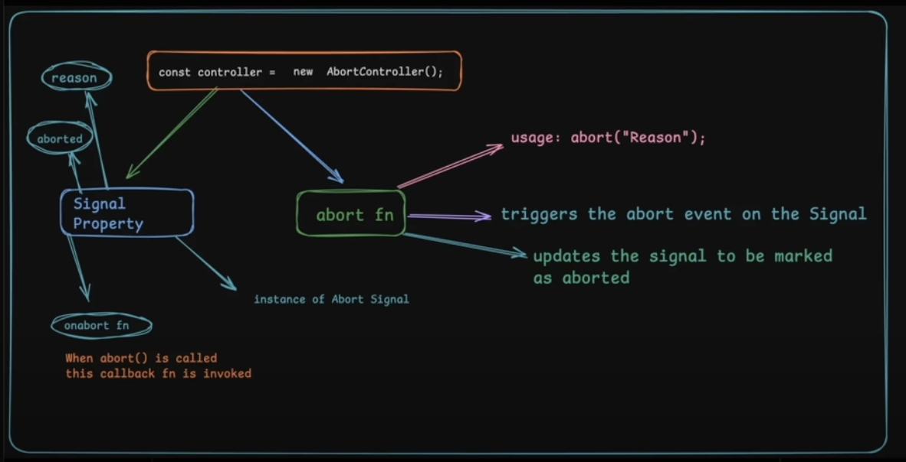
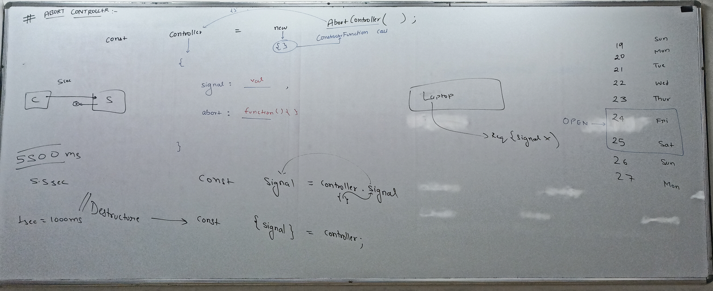

- It is a webabi
- It is not a part of javascript it is a part of ecmascript
- web api (It is implemented by browsers and server side environments like Deno or nodejs)

## Does AbortController work in Node.js?

- Node.js 15+ supports AbortController for things like fetch().
- However, older Node.js versions do not have built-in support.

## Why use

- It is more descriptive.
-
- Standard way of cancelling things. Align with libraries code. Library code becomes more friendly.

### Syntax

