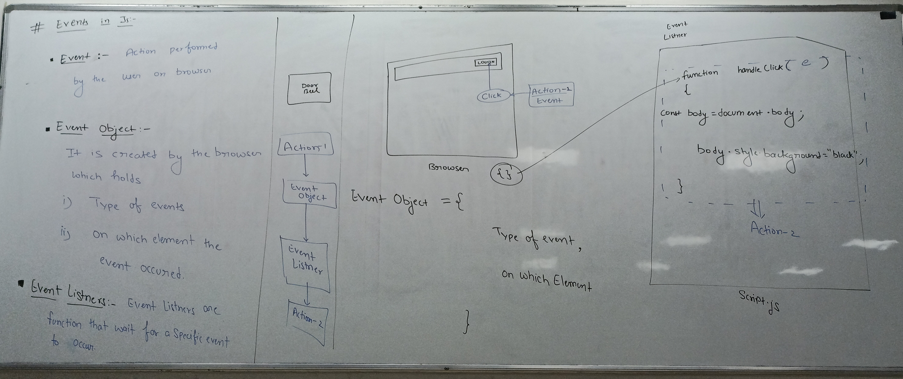

# JavaScript Events - Complete Guide

## Table of Contents
1. [What are Events?](#what-are-events)
2. [Event Object](#event-object)
3. [Event Listeners](#event-listeners)
4. [Ways to Handle Events](#ways-to-handle-events)
5. [Mouse Events](#mouse-events)
6. [Keyboard Events](#keyboard-events)
7. [Form Events](#form-events)
8. [Event Methods](#event-methods)
9. [Best Practices](#best-practices)
10. [Complete Examples](#complete-examples)
---

## What are Events?

Events are **actions performed by the user on the browser** or actions that happen in the browser environment. When any interaction occurs (like clicking, typing, scrolling), the browser creates an event object containing information about what happened.
- Actions Performed by user on browser are refered as a events.
- Whenever event occurs browser creates an object which contains all info about the event and object on which efent occured.
- Ex : if user click on `<h1>` tag, browser automatically creates an object which have info about `<h1>` tag and type of event occured (here, type is `clicK`).

### Event Flow
```
User Action → Event Object Creation → Event Listener → Response Action
```

---

## Event Object

The **Event Object** is automatically created by the browser when an event occurs. It contains:
- Event object is a object created by the browser when user perform some action, which holds all information about type of event occured and the element on which the event occurred.
- Event object is passed to respective event handler, every time event occured.
- So, we can access event object in callback function.
- **Type of event** (click, keydown, mouseover, etc.)
- **Target element** (which element triggered the event)
- **Additional properties** specific to the event type

```javascript
// Event object example
button.addEventListener("click", function(e) {
    console.log(e.type);        // "click"
    console.log(e.target);      // The button element
    console.log(e.timeStamp);   // When the event occurred
});
```

---


## Event Listeners

**Event Listeners** are functions that wait for specific events to occur and execute code when those events happen.

### Syntax
```javascript
element.addEventListener(eventType, callbackFunction, options);
```

---

## Ways to Handle Events

### 1. Inline Event Handlers (HTML)
```html
<!-- Direct in HTML -->
<button onclick="changeText()">Click Me</button>
```

```javascript
function changeText() {
    const h2 = document.querySelector("h2");
    h2.textContent = "Namaste World..!!";
}
```

**Pros:** Simple and direct
**Cons:** Mixes HTML and JavaScript, harder to maintain

### 2. Element Property Assignment
```javascript
const button = document.querySelector("button");
button.onclick = function() {
    const h2 = document.querySelector("h2");
    h2.textContent = "Namaste Duniya..!!";
};
```

**Pros:** Separates HTML and JavaScript
**Cons:** Can only assign one function per event

### 3. addEventListener() Method (Recommended)
```javascript
const button = document.querySelector("button");
button.addEventListener("click", function() {
    console.log("Clicked...!!!");
    console.log("this:", this); // refers to the button element
    const body = document.body;
    body.style.cssText = "color: white; background: black";
});
```

**Pros:**
- Can attach multiple listeners to same event
- More control and flexibility
- Better for complex applications

---

## Mouse Events

### Complete List of Mouse Events

| Event | Description | When it fires |
|-------|-------------|---------------|
| `click` | Single mouse click | On mouse button press and release |
| `dblclick` | Double mouse click | Two rapid clicks |
| `mousedown` | Mouse button pressed | When mouse button is pressed down |
| `mouseup` | Mouse button released | When mouse button is released |
| `mouseover` | Mouse enters element | When mouse pointer enters element |
| `mouseout` | Mouse leaves element | When mouse pointer leaves element |
| `mouseenter` | Mouse enters element | Similar to mouseover but doesn't bubble |
| `mouseleave` | Mouse leaves element | Similar to mouseout but doesn't bubble |
| `mousemove` | Mouse moves | When mouse pointer moves |
| `contextmenu` | Right mouse click | When right mouse button is clicked |
| `wheel` | Mouse wheel scroll | When mouse wheel is scrolled |

### Mouse Event Examples

#### Basic Click Event
```javascript
const button = document.querySelector("button");
button.addEventListener("click", function() {
    console.log("Button clicked!");
});
```

#### Mouse Down/Up Events
```javascript
const button = document.querySelector("button");
const body = document.body;
button.addEventListener("mousedown", function() {
    body.style.background = "red";
});
button.addEventListener("mouseup", function() {
    body.style.background = "white";
});
```

#### Mouse Hover Effects
```javascript
button.addEventListener("mouseover", function() {
    const body = document.body;
    body.style.background = "black";
});
button.addEventListener("mouseout", function() {
    const body = document.body;
    body.style.background = "white";
});
```

#### Context Menu (Right Click)
```javascript
const body = document.body;
body.addEventListener("contextmenu", function(e) {
    e.preventDefault(); // Prevents default context menu
    console.log("Right Clicked...");
});
```

#### Mouse Wheel Event
```javascript
body.addEventListener("wheel", function(e) {
    console.log("Scroll direction:", e.deltaY > 0 ? "Down" : "Up");
    console.log("Scroll amount:", e.deltaY);
});
```

---

## Keyboard Events

### Types of Keyboard Events

| Event | Description | When it fires |
|-------|-------------|---------------|
| `keydown` | Key is pressed down | When any key is pressed (repeats if held) |
| `keyup` | Key is released | When any key is released |
| `keypress` | Key is pressed | **Deprecated** - use keydown instead |

### Keyboard Event Properties

```javascript
window.addEventListener("keydown", function(e) {
    console.log("Key:", e.key);          // The key value (e.g., "a", "Enter", "Shift")
    console.log("Code:", e.code);        // Physical key code (e.g., "KeyA", "Enter")
    console.log("Ctrl:", e.ctrlKey);     // Boolean - was Ctrl pressed?
    console.log("Shift:", e.shiftKey);   // Boolean - was Shift pressed?
    console.log("Alt:", e.altKey);       // Boolean - was Alt pressed?
    console.log("Meta:", e.metaKey);     // Boolean - was Meta/Cmd pressed?
});
```

### Keyboard Event Examples

#### Basic Key Detection
```javascript
window.addEventListener("keydown", function(e) {
    console.log("Key pressed:", e.key);

    if (e.key === "Enter") {
        console.log("Enter key was pressed!");
    }
});
```

#### Keyboard Shortcuts (Fixed Version)
```javascript
// Dark mode toggle with Ctrl+D
window.addEventListener("keydown", function(e) {
    if (e.ctrlKey && e.key === "d") {
        e.preventDefault(); // Prevent browser's default bookmark action

        const body = document.body;
        // Toggle between light and dark mode
        if (body.style.backgroundColor === "black") {
            body.style.backgroundColor = "white";
            body.style.color = "black";
        } else {
            body.style.backgroundColor = "black";
            body.style.color = "white";
        }
    }
});
```

#### Alert on Specific Key
```javascript
window.addEventListener("keydown", function(e) {
    if (e.key === "a" || e.key === "A") {
        e.preventDefault();
        alert("Welcome to another World");
    }
});
```

---

## Form Events

### Common Form Events

| Event | Description | When it fires |
|-------|-------------|---------------|
| `submit` | Form submission | When form is submitted |
| `reset` | Form reset | When form is reset |
| `focus` | Element gains focus | When element becomes active |
| `blur` | Element loses focus | When element becomes inactive |
| `change` | Value changes | When input value changes and loses focus |
| `input` | Value being typed | Real-time as user types |

### Form Event Examples

#### Form Submission Handling
```javascript
const form = document.querySelector("form");

form.addEventListener("submit", function(e) {
    e.preventDefault(); // Prevent default form submission

    // Get form data
    const formData = new FormData(this);
    const username = formData.get("username");
    const email = formData.get("emailid");
    const password = formData.get("password");

    console.log("Username:", username);
    console.log("Email:", email);
    console.log("Password:", password);

    // Validate data here
    if (!username || !email || !password) {
        alert("Please fill all required fields");
        return;
    }

    alert("Form submitted successfully!");
});
```
<br><br><br><br><br><br><br><br><br><br>

#### Input Validation
```javascript
const usernameInput = document.querySelector("#inp1");
const emailInput = document.querySelector("#inp2");

// Real-time validation
usernameInput.addEventListener("input", function(e) {
    const value = e.target.value;
    if (value.length < 3) {
        e.target.style.borderColor = "red";
    } else {
        e.target.style.borderColor = "green";
    }
});

// Email validation on blur
emailInput.addEventListener("blur", function(e) {
    const email = e.target.value;
    const emailRegex = /^[^\s@]+@[^\s@]+\.[^\s@]+$/;

    if (!emailRegex.test(email)) {
        e.target.style.borderColor = "red";
        alert("Please enter a valid email address");
    } else {
        e.target.style.borderColor = "green";
    }
});
```

---

## Event Methods

### preventDefault()
Stops the default action of an event from happening.

```javascript
// Prevent form submission
form.addEventListener("submit", function(e) {
    e.preventDefault();
    console.log("Form submission prevented");
});

// Prevent right-click context menu
document.addEventListener("contextmenu", function(e) {
    e.preventDefault();
});
```

### stopPropagation()
Stops the event from bubbling up to parent elements.

```javascript
button.addEventListener("click", function(e) {
    e.stopPropagation();
    console.log("Event stopped here");
});
```

### removeEventListener()
Removes a previously added event listener.

```javascript
function clickHandler() {
    console.log("Clicked!");
}

// Add listener
button.addEventListener("click", clickHandler);

// Remove listener
button.removeEventListener("click", clickHandler);
```

---


## Advanced Event Concepts

### Event Bubbling and Capturing

Events in JavaScript follow a specific flow:
1. **Capturing Phase**: Event travels from document to target element
2. **Target Phase**: Event reaches the target element
3. **Bubbling Phase**: Event bubbles back up to document

```javascript
// Capturing (third parameter = true)
element.addEventListener("click", handler, true);

// Bubbling (default)
element.addEventListener("click", handler, false);
```

### Event Delegation
Handle events for multiple elements using a single listener on a parent element.

```javascript
// Instead of adding listeners to each button
const container = document.querySelector(".button-container");

container.addEventListener("click", function(e) {
    if (e.target.tagName === "BUTTON") {
        console.log("Button clicked:", e.target.textContent);
    }
});
```

---

<br><br><br>

## Complete Working Examples

### 1. Theme Switcher (Corrected Version)
```javascript
// Better implementation with error handling
const lightBtn = document.querySelector("#light");
const darkBtn = document.querySelector("#dark");

function switchTheme(theme) {
    const link = document.querySelector("link[rel='stylesheet']");
    if (link) {
        link.href = `${theme}.css`;
    } else {
        console.error("Stylesheet link not found");
    }
}

if (lightBtn) {
    lightBtn.addEventListener("click", function() {
        switchTheme("light");
    });
}

if (darkBtn) {
    darkBtn.addEventListener("click", function() {
        switchTheme("dark");
    });
}
```

<br><br><br><br><br><br><br><br><br><br><br><br><br><br><br><br><br><br>
<br><br><br><br>

### 2. Advanced Keyboard Controls
```javascript
// Improved keyboard event handling
const keyStates = {
    ctrl: false, shift: false, alt: false
};

window.addEventListener("keydown", function(e) {
    // Track modifier keys
    keyStates.ctrl = e.ctrlKey;
    keyStates.shift = e.shiftKey;
    keyStates.alt = e.altKey;

    console.log(`Key pressed: ${e.key}`);

    // Keyboard shortcuts
    if (e.ctrlKey && e.key === "d") {
        e.preventDefault();
        toggleDarkMode();
    }
    if (e.ctrlKey && e.key === "s") {
        e.preventDefault();
        saveContent();
    }
    // Special key handling
    if (e.key === "Escape") {
        closeModal();
    }
    if (e.key === "Enter" && e.ctrlKey) {
        submitForm();
    }
});

window.addEventListener("keyup", function(e) {
    // Update modifier key states
    keyStates.ctrl = e.ctrlKey;
    keyStates.shift = e.shiftKey;
    keyStates.alt = e.altKey;
});

function toggleDarkMode() {
    const body = document.body;
    const isDark = body.style.backgroundColor === "black";

    body.style.backgroundColor = isDark ? "white" : "black";
    body.style.color = isDark ? "black" : "white";
}

function saveContent() {
    console.log("Save shortcut triggered!");
    // Implement save functionality
}

function closeModal() {
    console.log("Escape pressed - closing modal");
    // Implement modal close
}

function submitForm() {
    console.log("Ctrl+Enter pressed - submitting form");
    // Implement form submission
}
```

---

## Event Types Reference

### Mouse Events Deep Dive

```javascript
const element = document.querySelector("#target");

// Click events
element.addEventListener("click", (e) => {
    console.log("Single click");
});

element.addEventListener("dblclick", (e) => {
    console.log("Double click");
});

// Mouse button events
element.addEventListener("mousedown", (e) => {
    console.log(`Mouse button ${e.button} pressed`);
    // 0 = left, 1 = middle, 2 = right
});

element.addEventListener("mouseup", (e) => {
    console.log(`Mouse button ${e.button} released`);
});

// Mouse movement events
element.addEventListener("mouseover", (e) => {
    console.log("Mouse entered element");
    e.target.style.backgroundColor = "lightblue";
});

element.addEventListener("mouseout", (e) => {
    console.log("Mouse left element");
    e.target.style.backgroundColor = "";
});

// Mouse position tracking
element.addEventListener("mousemove", (e) => {
    console.log(`Mouse position: (${e.clientX}, ${e.clientY})`);
});
```

<br><br><br><br><br><br><br><br><br><br><br><br><br><br>

### Keyboard Events Deep Dive

```javascript
// Key detection with modifiers
window.addEventListener("keydown", function(e) {
    const keyCombo = [];
    if (e.ctrlKey) keyCombo.push("Ctrl");
    if (e.shiftKey) keyCombo.push("Shift");
    if (e.altKey) keyCombo.push("Alt");
    if (e.metaKey) keyCombo.push("Meta");

    keyCombo.push(e.key);

    console.log("Key combination:", keyCombo.join(" + "));

    // Handle special combinations
    switch(true) {
        case e.ctrlKey && e.key === "z":
            e.preventDefault();
            console.log("Undo action");
            break;

        case e.ctrlKey && e.key === "y":
            e.preventDefault();
            console.log("Redo action");
            break;

        case e.ctrlKey && e.shiftKey && e.key === "N":
            e.preventDefault();
            console.log("New private window");
            break;
    }});
```

---

## Window and Document Events

```javascript
// Page load events
window.addEventListener("load", function() {
    console.log("Page fully loaded");
});
document.addEventListener("DOMContentLoaded", function() {
    console.log("DOM ready");
});

// Window resize
window.addEventListener("resize", function() {
    console.log(`Window size: ${window.innerWidth}x${window.innerHeight}`);
});

// Scroll events
window.addEventListener("scroll", function() {
    console.log(`Scroll position: ${window.scrollY}`);
});
// Before page unload
window.addEventListener("beforeunload", function(e) {
    e.preventDefault();
    e.returnValue = ""; // Shows confirmation dialog
});
```

---

## Best Practices

### 1. Always Use addEventListener()
- More flexible than other methods
- Allows multiple listeners per event
- Better for maintainable code

### 2. Use Event Delegation for Dynamic Content
```javascript
// Good for dynamically added elements
document.addEventListener("click", function(e) {
    if (e.target.classList.contains("dynamic-button")) {
        handleDynamicClick(e);
    }
});
```

### 3. Clean Up Event Listeners
```javascript
// Store reference to remove later
const clickHandler = function(e) {
    console.log("Clicked!");
};

element.addEventListener("click", clickHandler);

// Remove when no longer needed
element.removeEventListener("click", clickHandler);
```

### 4. Use Debouncing for Expensive Operations
```javascript
function debounce(func, wait) {
    let timeout;
    return function executedFunction(...args) {
        const later = () => {
            clearTimeout(timeout);
            func(...args);
        };
        clearTimeout(timeout);
        timeout = setTimeout(later, wait);
    };
}

// Debounced scroll handler
const debouncedScroll = debounce(function() {
    console.log("Scroll handled");
}, 100);

window.addEventListener("scroll", debouncedScroll);
```

### 5. Error Handling
```javascript
element.addEventListener("click", function(e) {
    try {
        // Your event handling code
        performAction();
    } catch (error) {
        console.error("Event handler error:", error);
    }
});
```

---

## Common Errors and Fixes

### Error 1: Event Listener Not Working
**Problem:** Element not found when script runs
```javascript
// ❌ Bad - script runs before DOM is ready
const button = document.querySelector("button");
button.addEventListener("click", handler); // button might be null
```

**Solution:**
```javascript
// ✅ Good - wait for DOM or check if element exists
document.addEventListener("DOMContentLoaded", function() {
    const button = document.querySelector("button");
    if (button) {
        button.addEventListener("click", handler);
    }
});
```

### Error 2: this Context Confusion
```javascript
// ❌ Arrow functions don't have their own 'this'
button.addEventListener("click", (e) => {
    console.log(this); // Window object, not button
});

// ✅ Regular function maintains 'this' context
button.addEventListener("click", function(e) {
    console.log(this); // Button element
});
```

<br><br><br>

### Error 3: Memory Leaks
```javascript
// ❌ Bad - creates new function each time
for (let i = 0; i < buttons.length; i++) {
    buttons[i].addEventListener("click", function() {
        console.log(`Button ${i} clicked`);
    });
}

// ✅ Good - reuse function or use event delegation
function buttonClickHandler(e) {
    console.log("Button clicked:", e.target.textContent);
}
buttons.forEach(button => {
    button.addEventListener("click", buttonClickHandler);
});
```

---

## Performance Tips

### 1. Passive Event Listeners
```javascript
// For scroll and touch events
window.addEventListener("scroll", handler, { passive: true });
```

### 2. Once Option
```javascript
// Listener runs only once then removes itself
button.addEventListener("click", handler, { once: true });
```

### 3. Throttling for High-Frequency Events
```javascript
function throttle(func, limit) {
    let inThrottle;
    return function() {
        const args = arguments;
        const context = this;
        if (!inThrottle) {
            func.apply(context, args);
            inThrottle = true;
            setTimeout(() => inThrottle = false, limit);
        }
    };
}
// Throttled mousemove
element.addEventListener("mousemove", throttle(function(e) {
    console.log("Mouse moved");
}, 100));
```

---

## Modern Event Handling Patterns

### 1. Event Handler Classes
```javascript
class EventManager {
    constructor() {
        this.handlers = new Map();
        this.init();
    }
    init() {
        this.bindEvents();
    }
    bindEvents() {
        document.addEventListener("click", this.handleClick.bind(this));
        document.addEventListener("keydown", this.handleKeydown.bind(this));
    }

    handleClick(e) {
        if (e.target.matches("[data-action]")) {
            const action = e.target.dataset.action;
            this.executeAction(action, e);
        }
    }
    handleKeydown(e) {
        const key = `${e.ctrlKey ? "ctrl+" : ""}${e.key}`;
        if (this.handlers.has(key)) {
            e.preventDefault();
            this.handlers.get(key)(e);
        }
    }

    registerShortcut(key, handler) {
        this.handlers.set(key, handler);
    }

    executeAction(action, event) {
        switch(action) {
            case "toggle-theme":
                this.toggleTheme();
                break;
            case "save":
                this.save();
                break;
            default:
                console.log(`Unknown action: ${action}`);
        }
    }

    toggleTheme() {
        document.body.classList.toggle("dark-theme");
    }

    save() {
        console.log("Saving...");
    }
}

// Usage
const eventManager = new EventManager();
eventManager.registerShortcut("ctrl+s", () => console.log("Save shortcut"));
eventManager.registerShortcut("ctrl+d", () => console.log("Dark mode shortcut"));
```

### 2. Custom Events
```javascript
// Create custom events
const customEvent = new CustomEvent("themeChanged", {
    detail: { theme: "dark", timestamp: Date.now() }
});

// Listen for custom events
document.addEventListener("themeChanged", function(e) {
    console.log("Theme changed to:", e.detail.theme);
});

// Dispatch custom event
document.dispatchEvent(customEvent);
```


## Browser Compatibility Notes

- `addEventListener()` is supported in all modern browsers
- Some older browsers might need polyfills for newer event types
- Always test keyboard shortcuts across different operating systems
- Mobile devices have touch events instead of mouse events

## Summary

Events are the foundation of interactive web applications. Key takeaways:

1. **Always use `addEventListener()`** for maximum flexibility
2. **Handle errors gracefully** with try-catch blocks
3. **Prevent default actions** when needed with `e.preventDefault()`
4. **Clean up event listeners** to prevent memory leaks
5. **Use event delegation** for dynamic content
6. **Test thoroughly** across different browsers and devices

