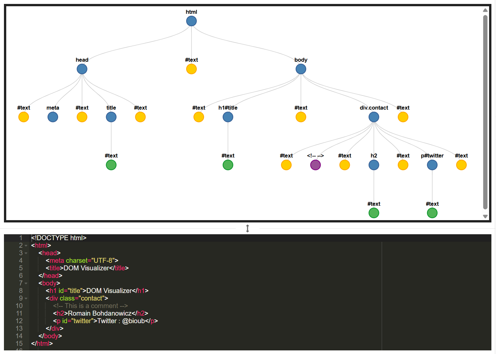
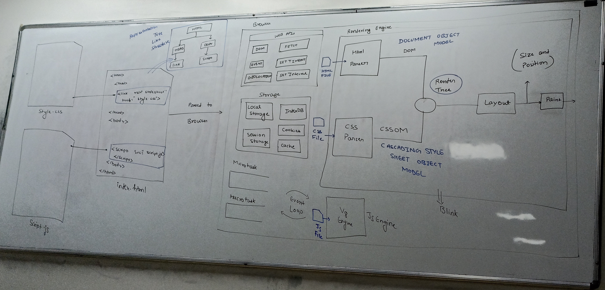
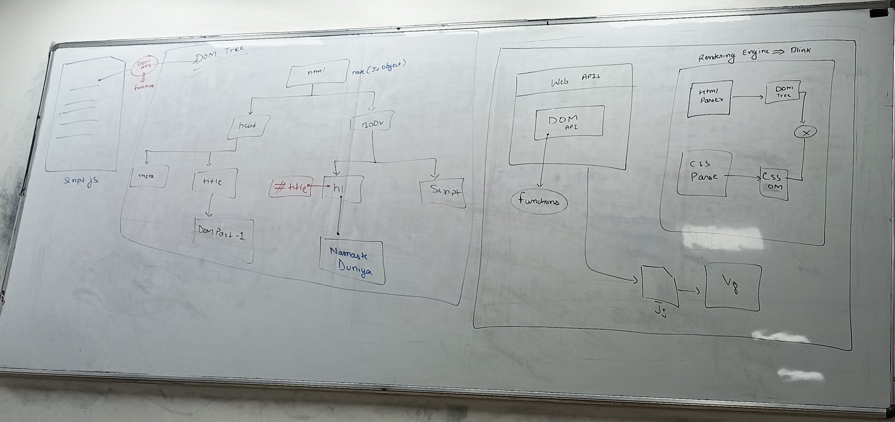

# DOM Manipulation Notes

## What is DOM?

**DOM stands for Document Object Model**

- The Document Object Model (DOM) is a programming interface for web documents that represents the HTML or XML document as a tree structure, where each node represents an element, attribute, or piece of text in the document.
- When a web page is loaded, the browser creates a DOM tree that represents the document's structure and content.
- Each node in the tree is represented as js object, which we can access and manipulate using the DOM API.
- Here, Html elements, comments, text, content, etc are refered as nodes of DOM tree.
- The Document Object Model (DOM) is the data representation of the objects that comprise the structure and content of a document on the web
- An HTML/XML document is represented inside the browser as the DOM tree. Tags become element nodes and form the structure. Text becomes text nodes
- Think of DOM as a bridge between your HTML code and JavaScript
- When browser loads your webpage, it creates a tree-like structure called DOM tree

## Why JavaScript Alone is Slow?

- JavaScript by itself is slow because it re-renders the page continuously
- Even small changes cause the entire page to refresh
- React is faster than plain JavaScript because it uses Virtual DOM
- React updates only the parts that actually changed, not the whole page

## How DOM Tree Works?

The HTML Document Object Model (DOM) is a tree structure, where each HTML tag becomes a node in the hierarchy

**Example:**
```html
<!DOCTYPE html>
<html>        ← Root Node
  <head>      ← Child of html
    <title>My Page</title>  ← Child of head
  </head>
  <body>      ← Child of html, Sibling of head
    <h1>Hello</h1>    ← Child of body
    <p>World!</p>     ← Child of body, Sibling of h1
  </body>
</html>
```

**Important:** Even empty spaces (like when you press Enter) are considered as text nodes in DOM!



## Types of Nodes in DOM

The DOM is structured as a tree of nodes that will usually be HTML elements, text, or comments

1. **Element Node** - HTML tags like `<h1>`, `<p>`, `<div>`
2. **Text Node** - The actual text content inside elements
3. **Attribute Node** - Properties like `id`, `class`, `src`
4. **Comment Node** - HTML comments `<!-- like this -->`
5. **Empty Space Node** - Whitespace and line breaks

**Key Point:** Each node is a JavaScript object with properties and methods!

## DOM API - The Bridge

**What is DOM API?**
- DOM API is the intermediate layer between JavaScript and the browser
- It's a set of programming interfaces that allow developers to communicate with the DOM tree
- DOM methods allow programmatic access to the tree. With them, you can change the document's structure, style, or content

<br><br><br><br>

**How it works:**
1. Your JavaScript code goes to V8 engine
2. But to change webpage, it needs to go to rendering engine
3. DOM API (part of Web APIs) makes this communication possible
4. DOM tree gets updated only through DOM API functions

## Browser Requirements

Any browser in the world only needs three types of files:
- `.html` file (structure)
- `.css` file (styling)
- `.js` file (functionality)

## What are Bundlers?

**Bundler is a tool that:**
- Combines multiple files of different types
- Gives the browser only the 3 files it needs (.html, .css, .js)
- In simple terms: bundler merges multiple files into optimized bundles

**Popular Bundlers:**
- **Webpack** - Most popular, highly configurable
- **Parcel** - Easy to use, zero configuration
- **Vite** - Very fast, modern
- **Rollup** - Fast and efficient

## DOM Manipulation Methods

### 1. Selecting Elements

```javascript
// By ID
const element = document.getElementById("myId");

// By Class Name
const elements = document.getElementsByClassName("myClass");

// By Tag Name
const elements = document.getElementsByTagName("p");


// Modern Selectors (Recommended)
const element = document.querySelector("#myId");
// It returns reference of the first element that matches a specified CSS selector.


const elements = document.querySelectorAll(".myClass");
// It returns Nodelist of all elements that matches a specified CSS selector.
```

### 2. Changing Content

```javascript
// Change text content
element.textContent = "New text content";

// Change HTML content
element.innerHTML = "<strong>Bold text</strong>";

// Get current content
console.log(element.textContent); // Gets text only
console.log(element.innerHTML);   // Gets HTML code
```

### 3. Styling Elements

There are two main ways of styling elements when working with the DOM in JavaScript. You can use the .style property or you can use classes

**Method 1: Direct Styling**
```javascript
element.style.color = "red";
element.style.fontSize = "40px";
element.style.backgroundColor = "blue";
```

**Method 2: CSS Classes (Recommended)**
```javascript
// Add class
element.classList.add("highlight");

// Remove class
element.classList.remove("highlight");

// Toggle class
element.classList.toggle("active");

// Check if class exists
if(element.classList.contains("highlight")) {
    console.log("Element has highlight class");
}
```

### 4. Creating New Elements

```javascript
// Create new element
const newDiv = document.createElement("div");

// Add content
newDiv.textContent = "I am a new div!";

// Add attributes
newDiv.id = "newElement";
newDiv.className = "highlight";

// Add to page
document.body.appendChild(newDiv);
```

### 5. Removing Elements

```javascript
// Remove element
element.remove();

// Or remove child from parent
parent.removeChild(childElement);
```

### 6. Changing Attributes

```javascript
// Set attribute
element.setAttribute("src", "image.jpg");
element.setAttribute("alt", "My Image");

// Get attribute
const srcValue = element.getAttribute("src");

// Remove attribute
element.removeAttribute("alt");

// For common attributes, use direct properties
element.id = "myId";
element.src = "image.jpg";
element.href = "https://example.com";
```

<br><br>

## Practical Example

**HTML File (index.html):**
```html
<!DOCTYPE html>
<html lang="en">
<head>
    <meta charset="UTF-8">
    <meta name="viewport" content="width=device-width, initial-scale=1.0">
    <title>DOM Manipulation</title>
</head>
<body>
    <h1 id="title">Namaste Developers</h1>
    <p class="description">Learning DOM manipulation</p>
    <button id="changeBtn">Change Content</button>

    <script src="script.js"></script>
</body>
</html>
```

<br><br><br><br><br><br>

**JavaScript File (script.js):**
```javascript
// Get elements
const h1 = document.getElementById("title");
const description = document.querySelector(".description");
const button = document.getElementById("changeBtn");

// Change h1 styling and content
h1.style.color = "red";
h1.style.fontSize = "40px";
h1.textContent = "Hello Developers";

// Add click event to button
button.addEventListener("click", function() {
    // Toggle between two messages
    if (h1.textContent === "Hello Developers") {
        h1.textContent = "Welcome to DOM!";
        h1.style.color = "blue";
    } else {
        h1.textContent = "Hello Developers";
        h1.style.color = "red";
    }
});

// Create and add new element
const newParagraph = document.createElement("p");
newParagraph.textContent = "This paragraph was created with JavaScript!";
newParagraph.style.fontWeight = "bold";
document.body.appendChild(newParagraph);
```

## Event Handling

```javascript
// Click event
element.addEventListener("click", function() {
    console.log("Element clicked!");
});

// Multiple events
element.addEventListener("mouseover", function() {
    element.style.backgroundColor = "yellow";
});

element.addEventListener("mouseout", function() {
    element.style.backgroundColor = "white";
});

// Form events
const form = document.querySelector("form");
form.addEventListener("submit", function(event) {
    event.preventDefault(); // Prevent form submission
    console.log("Form submitted!");
});
```

<br><br>

## DOM Navigation

With the HTML DOM, all nodes in the node tree can be accessed by JavaScript. New nodes can be created, and all nodes can be modified or deleted

```javascript
// Parent-Child Relationships
const parent = element.parentNode;
const children = element.childNodes;
const firstChild = element.firstChild;
const lastChild = element.lastChild;

// Sibling Relationships
const nextSibling = element.nextSibling;
const previousSibling = element.previousSibling;

// More specific (ignoring text nodes)
const parentElement = element.parentElement;
const childElements = element.children;
const firstElementChild = element.firstElementChild;
const nextElementSibling = element.nextElementSibling;
```

## Best Practices

1. **Use Modern Selectors:** Prefer `querySelector()` and `querySelectorAll()`
2. **Cache DOM Elements:** Store frequently used elements in variables
3. **Use CSS Classes:** Instead of direct styling when possible
4. **Event Delegation:** For dynamic content, use event delegation
5. **Minimize DOM Manipulations:** Batch changes together for better performance

## Performance Tips

1. **Cache Elements:**
```javascript
// Bad - searches DOM every time
document.getElementById("myButton").style.color = "red";
document.getElementById("myButton").textContent = "Click me";

// Good - cache the element
const button = document.getElementById("myButton");
button.style.color = "red";
button.textContent = "Click me";
```

2. **Use Document Fragments for Multiple Additions:**
```javascript
const fragment = document.createDocumentFragment();
for (let i = 0; i < 100; i++) {
    const div = document.createElement("div");
    div.textContent = `Item ${i}`;
    fragment.appendChild(div);
}
document.body.appendChild(fragment); // Add all at once
```

## Common Mistakes to Avoid

1. **Forgetting to check if element exists:**
```javascript
// Bad
const element = document.getElementById("nonexistent");
element.style.color = "red"; // Error!

// Good
const element = document.getElementById("myId");
if (element) {
    element.style.color = "red";
}
```

2. **Modifying DOM inside loops unnecessarily**
3. **Not using event delegation for dynamic content**
4. **Mixing JavaScript with HTML (inline event handlers)**

## Summary

- DOM is the bridge between HTML and JavaScript
- Everything in HTML becomes a node (object) in DOM tree
- DOM API provides methods to manipulate these nodes
- Modern browsers need only HTML, CSS, and JS files
- Use bundlers to optimize and combine multiple files
- Always cache DOM elements for better performance
- Prefer CSS classes over direct styling for maintainable code

**Remember:** DOM manipulation allows developers to interact with web pages and create dynamic and interactive experiences. By understanding how to select, create, modify, and delete elements, you gain full control over the page's appearance and behavior

<br>



<br><br><br>
