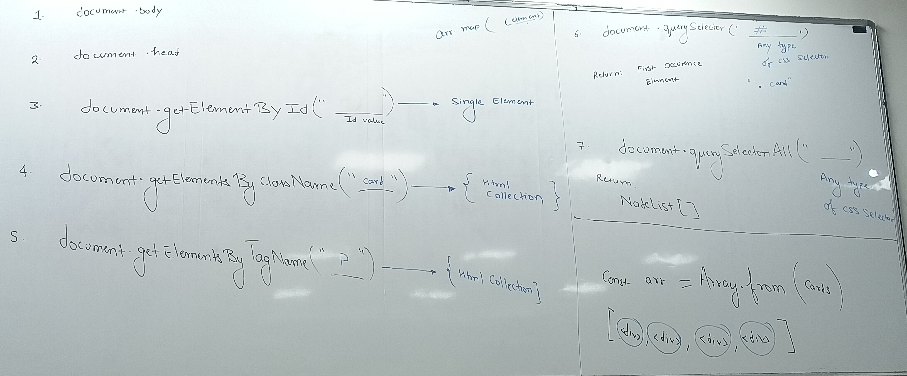

# Complete DOM Manipulation Guide

## Table of Contents
1. [Element Selection Methods](#element-selection-methods)
2. [HTML Collections vs NodeLists](#html-collections-vs-nodelists)
3. [Creating and Modifying Elements](#creating-and-modifying-elements)
4. [Interview Questions & Answers](#interview-questions--answers)

---

## Element Selection Methods

### 1. `document.getElementById()`

**Purpose**: Selects a single element by its unique ID attribute.

**Syntax**: `document.getElementById("elementId")`

**Returns**: Single element or `null` if not found

```javascript
// HTML: <h1 id="title">Hello World</h1>

const heading = document.getElementById("title");
heading.textContent = "Namaste Developers";
heading.style.color = "red";

console.log("heading:", heading);
// Output: <h1 id="title">Namaste Developers</h1>
```

**Key Points**:
- Returns only the **first** element with that ID
- IDs should be unique in HTML
- Most efficient selection method
- Returns `null` if element doesn't exist

---

### 2. `document.getElementsByClassName()`

**Purpose**: Selects all elements with a specific class name.

**Syntax**: `document.getElementsByClassName("className")`

**Returns**: Live HTMLCollection (array-like object)

```javascript
// HTML:
// <div class="card">Card 1</div>
// <div class="card">Card 2</div>
// <div class="card">Card 3</div>

// Method 1: Direct HTMLCollection (not a true array)
const cards = document.getElementsByClassName("card");
console.log(cards); // HTMLCollection(3)

// Method 2: Convert to Array for array methods
const arr = Array.from(document.getElementsByClassName("card"));
console.log("arr:", arr); // [div.card, div.card, div.card]

// Now we can use array methods
arr.map((element, index) => {
    element.style.color = "red";
    element.textContent = `Modified Card ${index + 1}`;
});

// Alternative: Using forEach with HTMLCollection
Array.from(cards).forEach((element, index) => {
    element.style.backgroundColor = "lightblue";
});
```

**Key Points**:
- Returns **live** HTMLCollection
- Automatically updates when DOM changes
- Need `Array.from()` to use array methods
- Case-sensitive class names

---

### 3. `document.getElementsByTagName()`

**Purpose**: Selects all elements with a specific tag name.

**Syntax**: `document.getElementsByTagName("tagName")`

**Returns**: Live HTMLCollection

```javascript
// HTML: Multiple <div> elements

const divs = document.getElementsByTagName("div");
console.log(divs); // HTMLCollection of all div elements

// Convert to array to modify all divs
const divArray = Array.from(divs);
divArray.forEach((div, index) => {
    div.style.color = "blue";
    div.style.border = "2px solid blue";
});

// Select specific elements
const paragraphs = document.getElementsByTagName("p");
const images = document.getElementsByTagName("img");
```
<br><br>

**Key Points**:
- Selects ALL elements with that tag
- Case-insensitive for HTML documents
- Returns live HTMLCollection
- Very broad selection method

---

### 4. `document.querySelector()`

**Purpose**: Selects the **first** element matching a CSS selector.

**Syntax**: `document.querySelector("cssSelector")`

**Returns**: Single element or `null`

```javascript
// Select by ID
const heading = document.querySelector("#title");
console.log(heading);

// Select by class
const firstCard = document.querySelector(".card");

// Select by tag
const firstDiv = document.querySelector("div");

// Complex selectors
const specificCard = document.querySelector(".container > .card:nth-child(3)");
const nestedElement = document.querySelector(".container .card p");

// Attribute selectors
const inputEmail = document.querySelector("input[type='email']");
const linkExternal = document.querySelector("a[href^='http']");
```

**Key Points**:
- Uses CSS selector syntax
- Returns only the **first** matching element
- Very flexible and powerful
- Returns `null` if no match found

---

### 5. `document.querySelectorAll()`

**Purpose**: Selects **all** elements matching a CSS selector.

**Syntax**: `document.querySelectorAll("cssSelector")`

**Returns**: Static NodeList

```javascript
// Select all cards
const cards = document.querySelectorAll(".card");
console.log(cards); // NodeList(3)

// NodeList has forEach method built-in
cards.forEach((element, index) => {
    element.style.color = "blue";
    element.textContent = `Card ${index + 1}`;
});

// Complex selections
const allLinks = document.querySelectorAll("a");
const externalLinks = document.querySelectorAll("a[href^='http']");
const evenCards = document.querySelectorAll(".card:nth-child(even)");

// Convert to array if needed
const cardsArray = Array.from(cards);
const cardsArraySpread = [...cards];
```

**Key Points**:
- Returns **static** NodeList
- Has built-in `forEach()` method
- Snapshot of elements at query time
- Most versatile selection method

---

## HTML Collections vs NodeLists

### HTMLCollection

```javascript
const cardHtmlCollection = document.getElementsByClassName("card");

// Live collection example
const c4 = document.getElementById("c4");
console.log("Before removal:", cardHtmlCollection.length); // 4

c4.remove();
console.log("After removal:", cardHtmlCollection.length); // 3 (automatically updated)
```

**Characteristics**:
- **Live**: Automatically updates when DOM changes
- **Array-like**: Has length and numeric indices
- **Limited methods**: No forEach, map, filter
- **Element-only**: Contains only element nodes

**Methods available**:
- `collection.length`
- `collection.item(index)`
- `collection.namedItem(name)`

### NodeList

```javascript
const cardNodeList = document.querySelectorAll(".card");

// Static collection example
const c4 = document.getElementById("c4");
console.log("Before removal:", cardNodeList.length); // 4

c4.remove();
console.log("After removal:", cardNodeList.length); // 4 (unchanged - static snapshot)
```

**Characteristics**:
- **Static**: Snapshot at query time (for querySelectorAll)
- **Array-like**: Has length and numeric indices
- **More methods**: Has forEach built-in
- **Any node type**: Can contain elements, text nodes, comments

**Methods available**:
- `nodeList.length`
- `nodeList.item(index)`
- `nodeList.forEach(callback)`
- `nodeList.keys()`
- `nodeList.values()`
- `nodeList.entries()`

### Visual Comparison

```javascript
// Live vs Static demonstration
const liveCollection = document.getElementsByClassName("test");
const staticNodeList = document.querySelectorAll(".test");

console.log("Initial - Live:", liveCollection.length);    // 3
console.log("Initial - Static:", staticNodeList.length);  // 3

// Add new element
const newDiv = document.createElement("div");
newDiv.className = "test";
document.body.appendChild(newDiv);

console.log("After addition - Live:", liveCollection.length);    // 4 (updated)
console.log("After addition - Static:", staticNodeList.length);  // 3 (unchanged)
```

---

## Creating and Modifying Elements

### 1. `document.createElement()`

**Purpose**: Creates a new HTML element.

**Syntax**: `document.createElement("tagName")`

```javascript
// Create elements
const heading = document.createElement("h1");
const paragraph = document.createElement("p");
const button = document.createElement("button");
const div = document.createElement("div");

// Set properties
heading.textContent = "Namaste Developers";
heading.id = "main-heading";
heading.className = "title-class";

paragraph.innerHTML = "This is a <strong>paragraph</strong>";
button.textContent = "Click Me";
```

### 2. `appendChild()` vs `append()`

#### `appendChild()`
- Adds **one** child element
- Returns the appended element
- Only accepts **Node** objects

```javascript
const heading = document.createElement("h1");
heading.textContent = "Namaste Developers";

const body = document.body;
body.appendChild(heading); // Adds to end of body

// Chaining example
const container = document.createElement("div");
const paragraph = document.createElement("p");
paragraph.textContent = "Hello World";

document.body.appendChild(container).appendChild(paragraph);
```

#### `append()`
- Adds **multiple** children
- Can add **strings** and **nodes**
- No return value (void)

```javascript
const container = document.createElement("div");
const heading = document.createElement("h1");
const paragraph = document.createElement("p");

heading.textContent = "Title";
paragraph.textContent = "Content";

// Append multiple elements and text
container.append(heading, paragraph, "Some text");
document.body.append(container);

// Mixed content
const section = document.createElement("section");
section.append("Section Title: ", heading, paragraph);
```

### 3. Other Insertion Methods

```javascript
const container = document.getElementById("container");
const newElement = document.createElement("div");
newElement.textContent = "New Element";

// Insert at beginning
container.prepend(newElement);

// Insert before/after specific element
const referenceElement = document.querySelector(".reference");
container.insertBefore(newElement, referenceElement);

// Modern insertion methods
referenceElement.before(newElement);     // Insert before
referenceElement.after(newElement);      // Insert after
referenceElement.replaceWith(newElement); // Replace element
```

### 4. Complete Example: Dynamic Content Creation

```javascript
// Create a complete card component
function createCard(title, content, imageUrl) {
    // Create elements
    const card = document.createElement("div");
    const cardHeader = document.createElement("div");
    const cardTitle = document.createElement("h3");
    const cardImage = document.createElement("img");
    const cardBody = document.createElement("div");
    const cardContent = document.createElement("p");
    const cardButton = document.createElement("button");

    // Set classes
    card.className = "card";
    cardHeader.className = "card-header";
    cardBody.className = "card-body";
    cardButton.className = "btn btn-primary";

    // Set content
    cardTitle.textContent = title;
    cardImage.src = imageUrl;
    cardImage.alt = title;
    cardContent.textContent = content;
    cardButton.textContent = "Learn More";

    // Build structure
    cardHeader.append(cardTitle, cardImage);
    cardBody.append(cardContent, cardButton);
    card.append(cardHeader, cardBody);

    return card;
}

// Use the function
const myCard = createCard(
    "JavaScript DOM",
    "Learn about DOM manipulation in JavaScript",
    "https://via.placeholder.com/300x200"
);

document.body.appendChild(myCard);
```

---

## Interview Questions & Answers

### Q1: What's the difference between HTMLCollection and NodeList?

**Answer**:

| HTMLCollection | NodeList |
|----------------|----------|
| **Live** - automatically updates | **Static** - snapshot at query time |
| Contains only **element nodes** | Contains any **node type** (elements, text, comments) |
| Limited methods (length, item) | More methods (forEach, keys, values) |
| From `getElementsBy*` methods | From `querySelectorAll` |

**Example**:
```javascript
// HTMLCollection (Live)
const liveCards = document.getElementsByClassName("card"); // Live

// NodeList (Static)
const staticCards = document.querySelectorAll(".card"); // Static

// Add new card
const newCard = document.createElement("div");
newCard.className = "card";
document.body.appendChild(newCard);

console.log(liveCards.length);   // Increases by 1
console.log(staticCards.length); // Stays the same
```

### Q2: When should you use `querySelector` vs `getElementById`?

**Answer**:

**Use `getElementById` when**:
- You have a specific ID
- Performance is critical (fastest method)
- Simple selection needed

**Use `querySelector` when**:
- You need complex CSS selectors
- Selecting by attributes, pseudo-classes
- Consistency in code style

```javascript
// getElementById - fastest for IDs
const header = document.getElementById("main-header");

// querySelector - more flexible
const firstCard = document.querySelector(".card:first-child");
const emailInput = document.querySelector("input[type='email']");
```

<br>

### Q3: What's the difference between `appendChild` and `append`?

**Answer**:

| appendChild | append |
|-------------|--------|
| Adds **one** node only | Adds **multiple** nodes/strings |
| Returns the appended node | Returns **undefined** |
| Node objects only | Accepts strings and nodes |

```javascript
const container = document.createElement("div");

// appendChild - one element, returns element
const heading = document.createElement("h1");
const returnedElement = container.appendChild(heading);
console.log(returnedElement === heading); // true

// append - multiple items, no return value
const paragraph = document.createElement("p");
container.append(paragraph, "Some text", heading); // void return
```

### Q4: How do you convert HTMLCollection to Array?

**Answer**:

```javascript
const htmlCollection = document.getElementsByClassName("item");

// Method 1: Array.from()
const array1 = Array.from(htmlCollection);

// Method 2: Spread operator
const array2 = [...htmlCollection];

// Method 3: Array.prototype.slice.call()
const array3 = Array.prototype.slice.call(htmlCollection);

// Now you can use array methods
array1.forEach(item => console.log(item));
array2.map(item => item.style.color = "red");
```

### Q5: What's the performance difference between selection methods?

**Answer** (from fastest to slowest):

1. **`getElementById`** - Fastest (hash table lookup)
2. **`querySelector`** - Fast (optimized CSS engine)
3. **`getElementsByClassName`** - Medium
4. **`getElementsByTagName`** - Medium
5. **`querySelectorAll`** - Slower (full CSS parsing)

**Benchmark Example**:
```javascript
// Fastest
const fastElement = document.getElementById("specific-id");

// Good performance
const goodElement = document.querySelector("#specific-id");

// Slower for simple selections
const slowElements = document.querySelectorAll("#specific-id");
```

### Q6: How do you safely remove elements from a live HTMLCollection?

**Answer**:

```javascript
// Problem: Removing from live collection while iterating
const items = document.getElementsByClassName("remove-me");

// ❌ Wrong way - skips elements as collection shrinks
for (let i = 0; i < items.length; i++) {
    items[i].remove(); // Collection length changes during loop!
}

// ✅ Correct way 1: Convert to static array first
const itemsArray = Array.from(items);
itemsArray.forEach(item => item.remove());

// ✅ Correct way 2: Remove from end to beginning
for (let i = items.length - 1; i >= 0; i--) {
    items[i].remove();
}

// ✅ Correct way 3: Always remove the first item
while (items.length > 0) {
    items[0].remove();
}
```

---

## Best Practices Summary

1. **Use `getElementById` for single elements by ID** - fastest performance
2. **Use `querySelector/querySelectorAll` for complex selections** - most flexible
3. **Convert HTMLCollections to arrays** when you need array methods
4. **Be careful with live collections** when modifying DOM during iteration
5. **Use `textContent` instead of `innerHTML`** when you don't need HTML parsing
6. **Cache DOM selections** in variables to avoid repeated queries
7. **Use `append()` for multiple elements**, `appendChild()` for single elements

<br><br><br><br>

---


