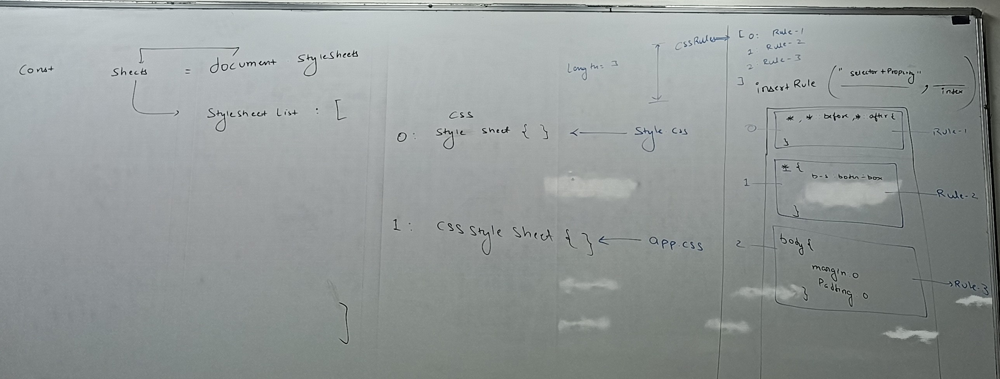
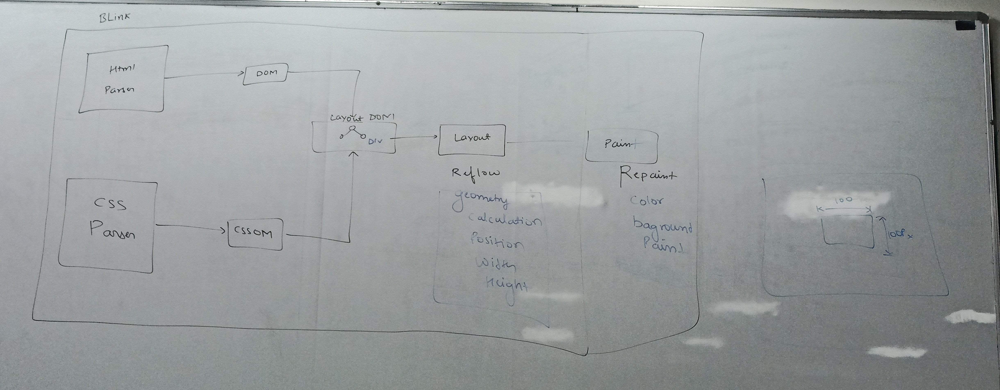

# Browser Rendering: Reflow and Repaint

## Understanding the Browser Rendering Pipeline

Before diving into reflow and repaint, it's important to understand the complete rendering pipeline:

1. **Parse HTML** → DOM Tree
2. **Parse CSS** → CSSOM Tree
3. **Combine DOM + CSSOM** → Render Tree
4. **Layout (Reflow)** → Calculate positions and sizes
5. **Paint (Repaint)** → Fill in the pixels
6. **Composite** → Layer composition

## Reflow (Layout)

- Reflow is the process of the browser calculating the geometric properties (position and size) of all the elements in the document. After a reflow, the browser rendering engine must recurssively figure out the layout of the page, meaning where each element is placed and how much space it takes up.

**causes**

- Adding, removing or updating DOM elements.
- Changing content (ex. text)
- Changing CSS properties like `width, height, font, margin, padding, pasition.`
- Resizing the browser window.
- Calculating `offsetwidth, offsetheight`, or other geometric properties(forces a reflow to get fresh value).

**Definition**: Reflow is the process of the browser calculating the geometric properties (position and size) of all the elements in the document.

After a reflow, the browser rendering engine must recursively figure out the layout of the page, meaning where each element is placed and how much space it takes up.

### What Happens During Reflow:
- Browser calculates the exact position of each element
- Determines the size (width, height) of elements
- Figures out how elements affect each other's positioning
- Updates the layout tree

### Causes of Reflow:

**DOM Modifications:**
- Adding, removing, or updating DOM elements
- Changing element content (innerHTML, textContent)
- Moving elements in the DOM

**Style Changes that Affect Layout:**
- Width, height modifications
- Padding, margin, border changes
- Font size or font family changes
- Position changes (absolute, relative, fixed)
- Display property changes
- Float changes

**Window/Viewport Changes:**
- Window resize
- Orientation changes (mobile)
- Scrolling (in some cases)

**JavaScript Operations:**
- Accessing certain properties that force layout calculation:
  - `offsetWidth`, `offsetHeight`
  - `scrollWidth`, `scrollHeight`
  - `clientWidth`, `clientHeight`
  - `getComputedStyle()`
  - `getBoundingClientRect()`

### Performance Impact:
- Reflow is **expensive** because it affects the entire document or large portions of it
- Can cascade to child and parent elements
- Forces the browser to recalculate layout for multiple elements

## Repaint (Paint)

- Repaint is the process of filling in the pixels  on the screen. After the reflow calculates where everything goes, the repaint step draws the visible parts of the elements to the screen, such as their colors, backgrounds, boarders and shadows.
**Causes**: Any change that affects ab element's visibility or styling without changing its layout.
- Changing CSS color `color, background-color: , visiblity, border-style, outline`

**The Key Difference**
- Reflow is about layout (geometry)
- Repaint is about display (pixels).

Crusially, a reflow will always trigger a subsequent repain because if an element's position or size changes, the browser must redraw it in its new place.

**Definition**: Repaint is the process of filling in the pixels on the screen. After the reflow calculates where everything should be positioned, repaint determines what each pixel should look like.

### What Happens During Repaint:
- Browser fills in the actual pixels with colors, images, borders, shadows
- Applies visual styles like background colors, text colors, borders
- Renders images, gradients, and other visual elements
- Does NOT change the layout or position of elements

### Causes of Repaint:

**Visual Style Changes:**
- Color changes (background-color, color)
- Border-color modifications
- Visibility changes
- Outline changes
- Background image changes
- Box-shadow changes
- Text-decoration changes

**Important Note**: Repaint happens **without** reflow when only visual properties change that don't affect layout.


### Performance Impact:
- Less expensive than reflow
- Only affects the visual rendering, not layout calculations
- Still costs performance, especially with complex styles

## Optimization Strategies

### 1. Batch DOM Operations
```javascript
// ❌ Bad - Multiple reflows
const div = document.getElementById('myDiv');
div.style.width = '200px';
div.style.height = '200px';
div.style.background = 'red';

// ✅ Good - Single reflow
div.style.cssText = 'width: 200px; height: 200px; background: red;';
```

<br><br><br><br><br><br><br><br>

### 2. Use DocumentFragment
```javascript
// ❌ Bad - Multiple reflows
for (let i = 0; i < 100; i++) {
    const div = document.createElement('div');
    document.body.appendChild(div); // Reflow each time
}

// ✅ Good - Single reflow
const fragment = document.createDocumentFragment();
for (let i = 0; i < 100; i++) {
    const div = document.createElement('div');
    fragment.appendChild(div);
}
document.body.appendChild(fragment); // Single reflow
```

### 3. Avoid Reading Layout Properties in Loops
```javascript
// ❌ Bad - Forces reflow in each iteration
for (let i = 0; i < elements.length; i++) {
    elements[i].style.width = element.offsetWidth + 10 + 'px';
}

// ✅ Good - Read once, apply to all
const width = element.offsetWidth;
for (let i = 0; i < elements.length; i++) {
    elements[i].style.width = width + 10 + 'px';
}
```


### 4. Use CSS Classes Instead of Inline Styles
```javascript
// ❌ Bad - Multiple style changes
element.style.width = '200px';
element.style.height = '200px';
element.style.background = 'red';

// ✅ Good - Single class change
element.className = 'my-styled-box';
```

### 5. Position Elements Outside Document Flow
- Use `position: absolute` or `position: fixed` for frequently changing elements
- Elements outside normal flow affect fewer elements during reflow

## CSS Properties That Trigger Reflow vs Repaint

### Properties that trigger REFLOW:
- width, height
- padding, margin
- border-width
- font-size, font-family
- position, top, left, bottom, right
- display
- float, clear
- overflow

### Properties that trigger only REPAINT:
- color
- background-color
- background-image
- border-color
- box-shadow
- outline
- visibility

### Properties that trigger NEITHER (Composite only):
- transform
- opacity
- filter


## Browser DevTools for Performance

Use browser DevTools to identify performance issues:
- **Performance tab**: Record and analyze reflow/repaint
- **Rendering tab**: Enable paint flashing to see repaint areas
- **Timeline**: See when reflows and repaints occur

## Key Takeaways

1. **Reflow is more expensive than repaint**
2. **Batch DOM operations** to minimize reflows
3. **Avoid reading layout properties** unnecessarily
4. **Use CSS transforms and opacity** for animations (they don't trigger reflow/repaint)
5. **Position frequently changing elements** outside document flow
6. **Profile your code** using browser DevTools to identify bottlenecks




<br><br><br>

