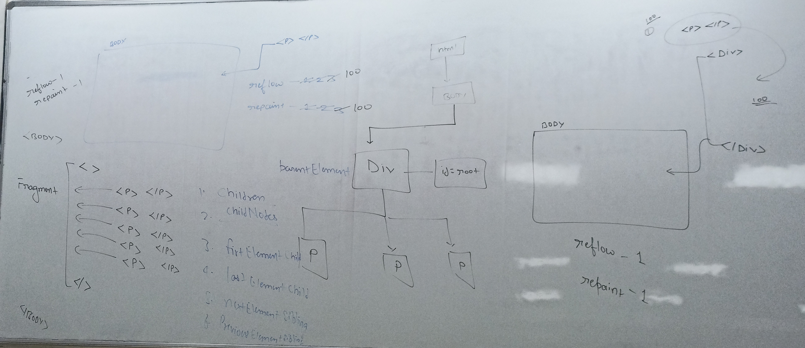
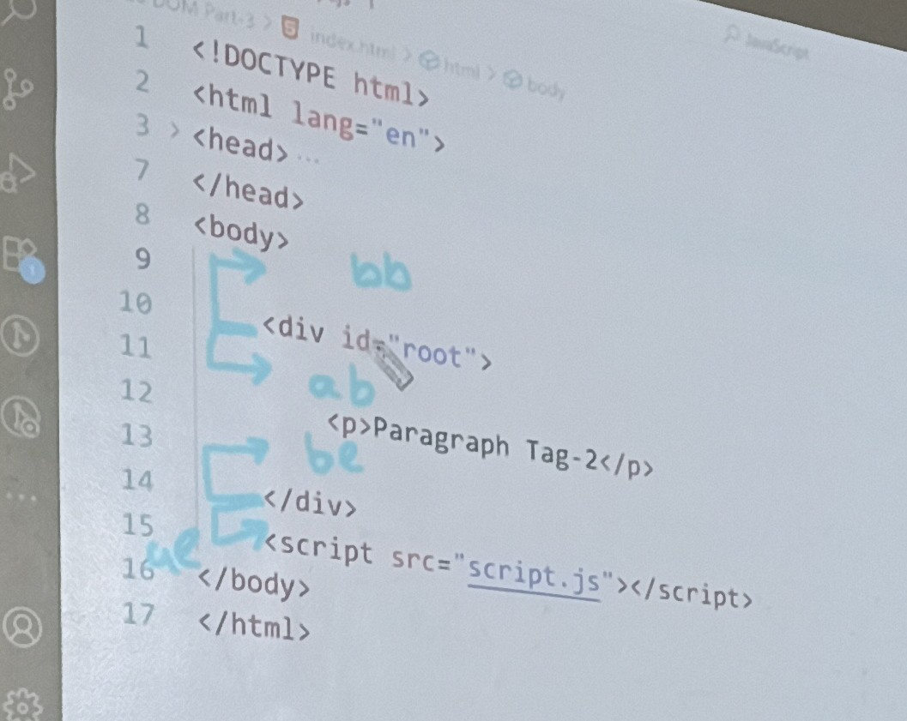

## 1. insertAdjacentElement(position, element)

The `insertAdjacentElement()` method inserts a given element node at a specified position relative to the element it is invoked upon.

### Syntax
```javascript
element.insertAdjacentElement(position, elementToInsert)
```

### Positions
- **`beforebegin`** - Before the target element itself
- **`afterbegin`** - Just inside the target element, before its first child
- **`beforeend`** - Just inside the target element, after its last child
- **`afterend`** - After the target element itself

### Visual Representation
```html
<!-- beforebegin -->
<div id="target">
  <!-- afterbegin -->
  <p>existing content</p>
  <!-- beforeend -->
</div>
<!-- afterend -->
```

### Example Code
```javascript
const div = document.getElementById("root");

// Create elements
const p1 = document.createElement("p");
p1.textContent = "Paragraph - 1";

const p3 = document.createElement("p");
p3.textContent = "Paragraph - 3";

// Insert elements
div.insertAdjacentElement("afterbegin", p1);  // First child
div.insertAdjacentElement("beforeend", p3);   // Last child

// Insert elements outside the target
const t1 = document.createElement("h2");
const t2 = document.createElement("h2");

t1.textContent = "Start";
t2.textContent = "End";
t1.style.color = "green";
t2.style.color = "red";

div.insertAdjacentElement("beforebegin", t1); // Before div
div.insertAdjacentElement("afterend", t2);    // After div
```

## 2. Attribute Methods

### setAttribute(attributeName, attributeValue)
Sets the value of an attribute on the specified element.

```javascript
const div = document.querySelector("div");

// Set a single attribute
div.setAttribute("class", "container");

// To preserve existing attributes, use concatenation
const existingClass = div.getAttribute("class");
div.setAttribute("class", `${existingClass} justify-center`);
```

**Important Notes:**
- If the attribute already exists, `setAttribute()` replaces the previous value
- To preserve existing values, first get the current value and concatenate

### getAttribute(attributeName)
Returns the value of a specified attribute on the element.

```javascript
const div = document.querySelector("div");
const classValue = div.getAttribute("class");
console.log(classValue); // Outputs the class attribute value
```

### removeAttribute(attributeName)
Removes the attribute with the specified name from the element.

```javascript
const div = document.querySelector("div");
div.removeAttribute("id"); // Removes the id attribute completely
```

<br><br><br><br><br><br><br><br><br><br><br><br><br>

### Complete Example
```javascript
const div = document.querySelector("div");

// Get current class
const currentClass = div.getAttribute("class");

// Add new class while preserving existing ones
div.setAttribute("class", `${currentClass} justify-center`);

// Remove an attribute
div.removeAttribute("id");

// Check the result
console.log(div.getAttribute("class"));
```

## 3. Content Manipulation Properties

### innerHTML
Gets or sets the HTML markup contained within the element.

```javascript
const div = document.querySelector("#root");
div.innerHTML = "<h1>Hello world</h1>"; // Replaces all content inside div
```

**Characteristics:**
- Adds content inside the target element
- Replaces existing content
- Can include HTML tags
- Parses HTML strings into DOM elements

### outerHTML
Gets or sets the HTML markup of the element including the element itself.

```javascript
const div = document.querySelector("#root");
div.outerHTML = "<section><h1>New Section</h1></section>";
```

**Characteristics:**
- Replaces the entire element (including the element itself)
- Creates a completely new structure
- The original element is removed from the DOM

### innerText
Gets or sets the text content of the element and its descendants.

```javascript
const div = document.querySelector("#root");
div.innerText = "Plain text content"; // Sets only text, no HTML
```

**Characteristics:**
- Only handles plain text
- Ignores HTML tags
- Respects CSS styling (hidden elements won't be included)

### Comparison Example
```javascript
const div = document.querySelector("#root");

// innerHTML - adds HTML inside the element
div.innerHTML = "<p>HTML content</p>";

// outerHTML - replaces the entire element
div.outerHTML = "<section>New element</section>";

// innerText - sets plain text only
div.innerText = "Just plain text";
```

## 4. DOM Traversal

### Parent Element
```javascript
const div = document.querySelector("#root");
console.log(div.parentElement); // Gets the parent element
```

### Child Elements
```javascript
const div = document.querySelector("#root");

console.log(div.children);           // HTMLCollection of child elements (3)
console.log(div.childNodes);         // NodeList including text nodes (7)
console.log(div.firstElementChild);  // First child element
console.log(div.lastElementChild);   // Last child element
```

**Key Difference:**
- `children` - Only element nodes
- `childNodes` - All nodes including text nodes (whitespace, line breaks)

<br><br><br><br>

### Sibling Navigation
```javascript
const div = document.querySelector("#root");

// Navigate to siblings
console.log(div.firstElementChild.nextElementSibling);     // Second child (p2)
console.log(div.lastElementChild.previousElementSibling);  // Second child (p2)
```


### Complete Traversal Example
```javascript
const div = document.querySelector("#root");

// Parent
console.log("Parent:", div.parentElement);

// Current element
console.log("Current:", div);

// Children
console.log("Element children:", div.children); // HTMLCollection
console.log("All child nodes:", div.childNodes); // NodeList

// First and last children
console.log("First child:", div.firstElementChild);
console.log("Last child:", div.lastElementChild);

// Sibling navigation
console.log("Second child:", div.firstElementChild.nextElementSibling);
console.log("Second child (from end):", div.lastElementChild.previousElementSibling);
```

## 5. Element Removal

### remove()
Removes the element from the DOM.

```javascript
const div = document.querySelector("#root");
div.children[2].remove(); // Removes the third child element
```

### removeChild(childElement)
Removes a specified child element from the parent.

```javascript
const div = document.querySelector("#root");
const p2 = document.querySelector("#root :nth-of-type(2)");
div.removeChild(p2); // Removes the second paragraph
```

**Key Differences:**
- `remove()` - Called on the element to be removed
- `removeChild()` - Called on the parent element, requires reference to child

### Removal Examples
```javascript
const div = document.querySelector("#root");

// Method 1: Direct removal
div.children[2].remove();

// Method 2: Parent removes child
const secondParagraph = document.querySelector("#root :nth-of-type(2)");
div.removeChild(secondParagraph);

// Method 3: Remove by selector
const elementToRemove = div.querySelector("p:last-child");
elementToRemove.remove();
```

## 6. Best Practices and Tips

### Performance Considerations
- Use `children` instead of `childNodes` when you only need element nodes
- Cache DOM queries in variables to avoid repeated selections
- Use `DocumentFragment` for multiple element insertions

### Error Handling
```javascript
// Always check if elements exist before manipulation
const element = document.querySelector("#myElement");
if (element) {
    element.setAttribute("class", "new-class");
}
```

### Common Patterns
```javascript
// Creating and inserting multiple elements
const fragment = document.createDocumentFragment();
for (let i = 0; i < 5; i++) {
    const p = document.createElement("p");
    p.textContent = `Paragraph ${i + 1}`;
    fragment.appendChild(p);
}
document.getElementById("root").appendChild(fragment);
```

<br><br><br><br><br><br><br><br>

## 7. Summary

| Method/Property | Purpose | Scope |
|---|---|---|
| `insertAdjacentElement()` | Insert elements at specific positions | Relative positioning |
| `setAttribute()` | Set attribute values | Element attributes |
| `getAttribute()` | Get attribute values | Element attributes |
| `removeAttribute()` | Remove attributes | Element attributes |
| `innerHTML` | HTML content inside element | Inner content |
| `outerHTML` | Replace entire element | Entire element |
| `innerText` | Text content only | Inner text |
| `remove()` | Remove element | Self removal |
| `removeChild()` | Remove child element | Parent-child removal |
| Traversal properties | Navigate DOM tree | Element relationships |

<br><br>
<br><br>
<br><br>
<br><br>
<br><br>
<br><br>
<br><br>
<br><br>
<br><br>
<br><br>
<br><br>
<br><br>




<br><br>


