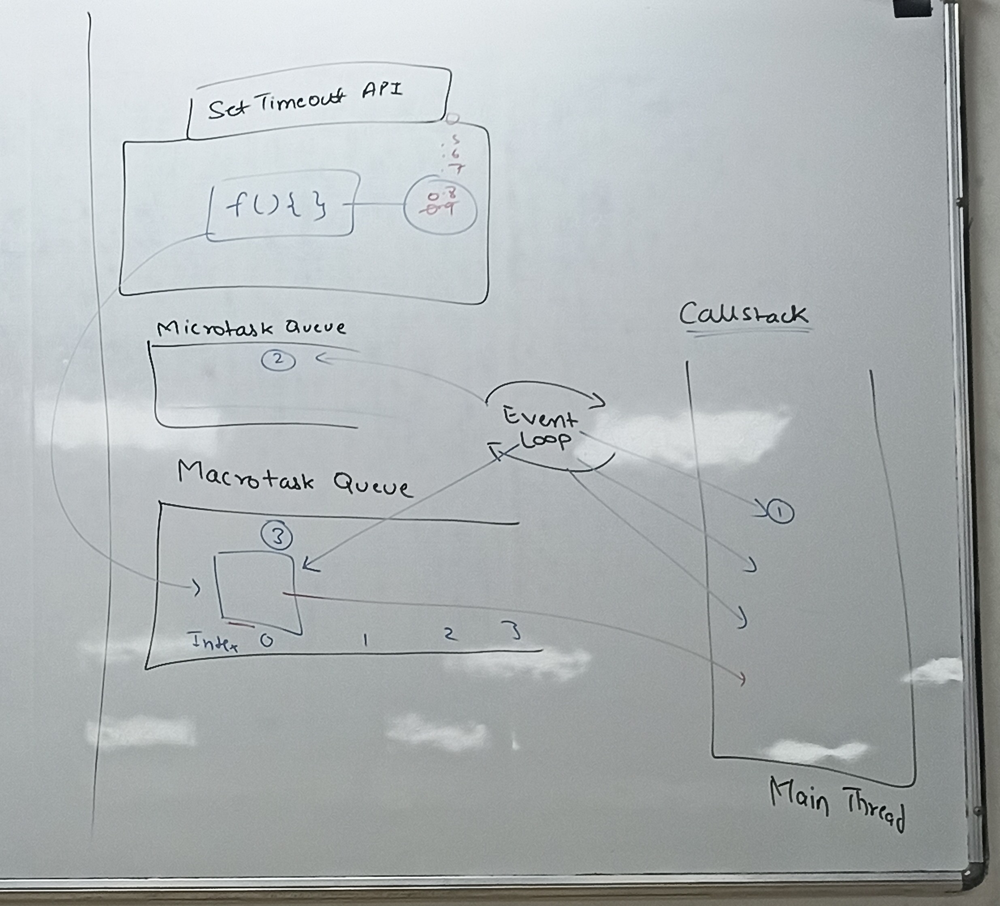
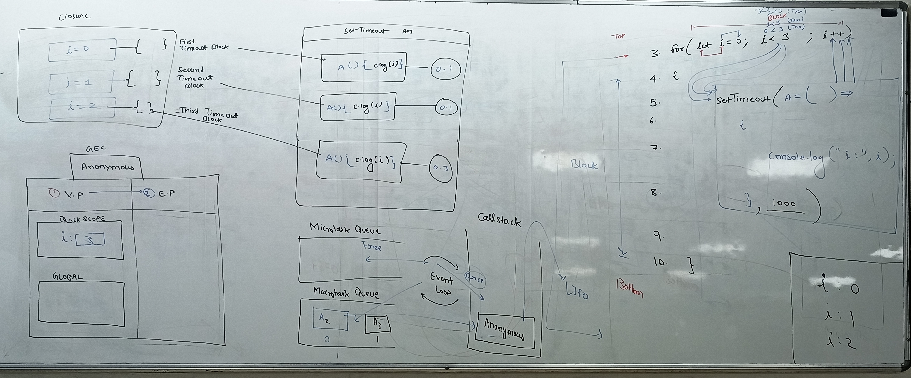
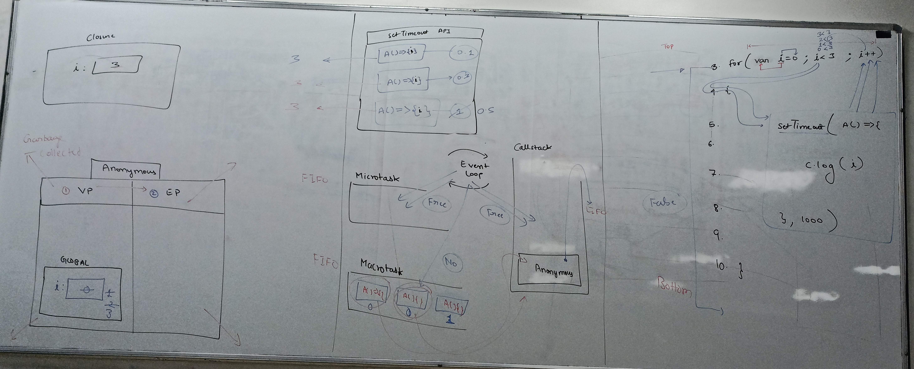

# setTimeout() - Complete Notes

## What is setTimeout()?
`setTimeout()` is a Web API method that executes a function or code snippet after a specified delay in milliseconds.

## Syntax
```javascript
setTimeout(function, delay, arg1, arg2, ...)
```

### Parameters:
1. **function**: The function to execute (can be function declaration, arrow function, or anonymous function)
2. **delay**: Time in milliseconds to wait before execution (1000ms = 1 second)
3. **arguments**: Optional parameters to pass to the function

## How setTimeout() Works

### Event Loop & Call Stack
- `setTimeout()` doesn't execute immediately
- It's handed over to Web APIs (browser environment)
- After the timer expires, the callback is placed in the **Task Queue**
- The **Event Loop** moves it to the **Call Stack** when the stack is empty

### Execution Order Example
```javascript
console.log("Start");           // 1st - Immediate

setTimeout(() => {
    console.log("Timeout 1");   // 4th - After 500ms
}, 500);

setTimeout(() => {
    console.log("Timeout 2");   // 3rd - After 0ms (but still async)
}, 0);

console.log("End");             // 2nd - Immediate
```

<br><br><br>

**Output:**
```
Start
End
Timeout 2
Timeout 1
```

## Variable Scope Issues with setTimeout()

### Problem with `var` (Function Scope)
```javascript
// ❌ Problem: Prints 3, 3, 3
for (var i = 0; i < 3; i++) {
    setTimeout(() => {
        console.log("i:", i);  // All print 3
    }, 0);
}
```

**Why this happens:**
- `var` has function scope, not block scope
- By the time setTimeout callbacks execute, loop has finished
- All callbacks reference the same `i` variable (value = 3)

### Solution 1: Use `let` (Block Scope)
```javascript
// ✅ Solution: Prints 0, 1, 2
for (let i = 0; i < 3; i++) {
    setTimeout(() => {
        console.log("i:", i);  // Prints 0, 1, 2
    }, 0);
}
```

### Solution 2: Use IIFE (Immediately Invoked Function Expression)
```javascript
// ✅ Solution with var and IIFE
for (var i = 0; i < 3; i++) {
    (function(index) {
        setTimeout(() => {
            console.log("i:", index);
        }, 0);
    })(i);
}
```

<br><br>

### Solution 3: Pass as Parameter
```javascript
// ✅ Solution: Pass i as parameter
for (var i = 0; i < 3; i++) {
    setTimeout((index) => {
        console.log("i:", index);
    }, 0, i);  // Pass i as third parameter
}
```

## Common Use Cases

### 1. Delayed Execution
```javascript
setTimeout(() => {
    alert("This appears after 3 seconds");
}, 3000);
```

### 2. Page Navigation
```javascript
setTimeout(() => {
    window.location.href = "about.html";
}, 2000);
```

### 3. Animation Delays
```javascript
setTimeout(() => {
    element.classList.add('fade-in');
}, 1000);
```

### 4. API Call Delays
```javascript
setTimeout(() => {
    fetchUserData();
}, 500);
```

<br><br><br><br><br>

## Clearing Timeouts
```javascript
// Set timeout and get ID
const timeoutId = setTimeout(() => {
    console.log("This might not run");
}, 5000);

// Clear timeout before it executes
clearTimeout(timeoutId);
```

## Best Practices

### ✅ Do's
- Use `let` or `const` in loops with setTimeout
- Always handle errors in timeout callbacks
- Use meaningful delay values
- Clear timeouts when component unmounts (React/Vue)
- Use arrow functions for cleaner syntax

### ❌ Don'ts
- Don't use `var` in loops with setTimeout
- Don't assume exact timing (delays can vary)
- Don't create memory leaks with uncleaned timeouts
- Don't use setTimeout for precise timing

## setTimeout vs setInterval

| setTimeout | setInterval |
|------------|-------------|
| Runs once after delay | Runs repeatedly at intervals |
| `setTimeout(fn, 1000)` | `setInterval(fn, 1000)` |
| Use for one-time delays | Use for repeated actions |

## Browser Compatibility
- Supported in all modern browsers
- Minimum delay varies by browser (usually 4ms)
- In background tabs, delays may be throttled

<br><br><br>

## Related Methods
- `setInterval()`: Repeats function at intervals
- `clearTimeout()`: Cancels a timeout
- `clearInterval()`: Cancels an interval
- `requestAnimationFrame()`: For smooth animations

<br><br>






