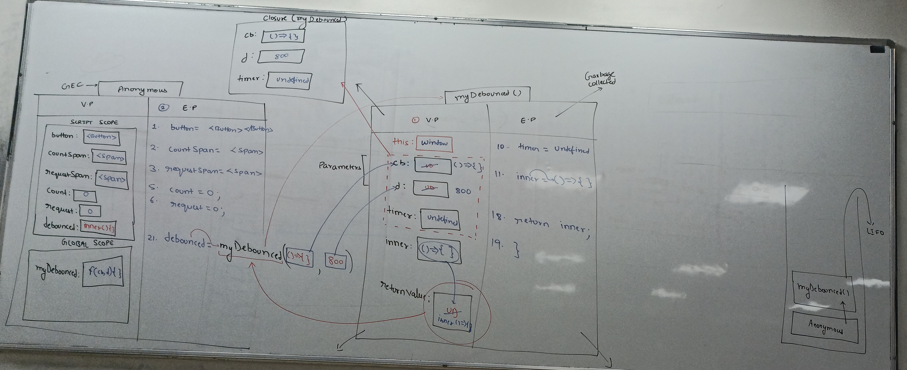
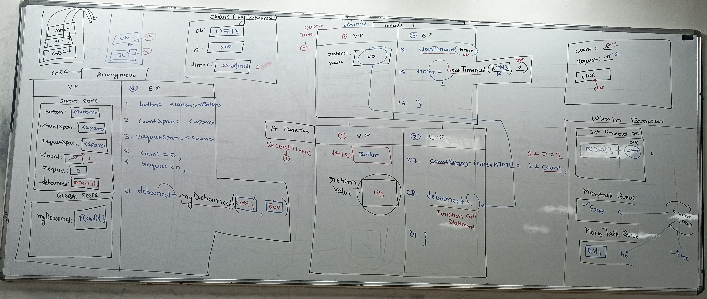

# JavaScript Debouncing - Complete Notes

## What is Debouncing?

Debouncing is a programming technique that ensures a function is only called once after a specified delay period has passed since the last time it was invoked. If the function is called again before the delay expires, the timer resets.

## How Debouncing Works

1. **When a function is called**: Start a timer
2. **If function is called before timer expires**: Cancel the previous timer and start a new one
3. **Only execute the function**: When the timer completes without interruption

## Common Use Cases

- **Search input field**: Wait until the user stops typing before making API calls
- **Window resize events**: Only recalculate layouts after the user finishes resizing
- **Button clicks**: Prevent accidental double-clicks from submitting forms twice
- **Scroll events**: Reduce the frequency of scroll-triggered calculations

## Implementation Example

### HTML Structure
```html
    <div class="box">
    <h1>Count <span id="countSpan" >0</span></h1>
    <h1>Request <span id="requestSpan">0</span></h1>
    <button>click</button>
    </div>


    <script src="https://cdn.jsdelivr.net/npm/lodash@4.17.21/lodash.min.js"></script>

    <script src="script.js"></script>
```

<br><br><br><br><br><br><br><br>

### JavaScript Implementation

```javascript
//script.js

const button = document.querySelector("button");
const countDisplay = document.querySelector("#countSpan");
const requestDisplay = document.querySelector("#requestSpan");

let count = 0;
let request = 0;

// Custom debounce function implementation
function myDebounced(cb, d) {
    let timer;
    return function () {
        clearTimeout(timer);
        timer = setTimeout(() => {
            cb();
        }, d);
    }
}

// Create debounced function with 1000ms delay
let debounced = myDebounced(() => {
    requestDisplay.innerHTML = ++request;
}, 1000)

// Event listener
button.addEventListener("click", function (e) {
    countDisplay.innerHTML = ++count;
    debounced();
})
```

### Using Lodash Debounce (Alternative)
```javascript
// Using lodash library (commented in original code)
// let debounced = _.debounce(() => {
//     requestDisplay.innerHTML = ++request;
// }, 800)

// button.addEventListener("click", function (e) {
//     countDisplay.innerHTML = ++count;
//     debounced();
// })
```

## How the Code Works

1. **Button Click**: Every click increments the `count` and updates the display immediately
2. **Debounced Function**: Only executes after 1000ms of no additional clicks
3. **Timer Reset**: Each new click cancels the previous timer and starts a new one
4. **API Request Simulation**: The `request` counter only increments when the debounced function finally executes

## Key Components of Debounce Function

```javascript
function myDebounced(cb, d) {
    let timer;                    // Stores the timer ID
    return function () {
        clearTimeout(timer);      // Cancel previous timer
        timer = setTimeout(() => { // Start new timer
            cb();                 // Execute callback after delay
        }, d);
    }
}
```

### Parameters:
- `cb`: Callback function to be debounced
- `d`: Delay in milliseconds

### Return Value:
- Returns a new debounced version of the original function

## Benefits of Debouncing

1. **Performance Optimization**: Reduces unnecessary function calls
2. **API Rate Limiting**: Prevents excessive API requests
3. **User Experience**: Prevents accidental duplicate actions
4. **Resource Management**: Saves computational resources

## Real-World Scenarios

### Search Input Debouncing
```javascript
const searchInput = document.querySelector('#search');

const debouncedSearch = myDebounced((query) => {
    // Make API call only after user stops typing
    fetch(`/api/search?q=${query}`)
        .then(response => response.json())
        .then(data => updateResults(data));
}, 500);

searchInput.addEventListener('input', (e) => {
    debouncedSearch(e.target.value);
});
```

<br><br>

### Window Resize Debouncing
```javascript
const debouncedResize = myDebounced(() => {
    // Recalculate layout only after resize ends
    calculateLayout();
}, 250);

window.addEventListener('resize', debouncedResize);
```

## Important Notes

- Debouncing delays execution until after the specified time has passed
- Each new function call resets the timer
- Only the last function call in a series will actually execute
- Choose appropriate delay times based on use case (typically 250-1000ms)
- Consider using established libraries like Lodash for production code

## Difference from Regular Function Calls

**Without Debouncing**: Function executes immediately on every call
**With Debouncing**: Function waits for a pause in calls before executing

This technique is essential for creating responsive and efficient web applications!

<br><br><br><br>
<br><br>
<br><br><br><br>
<br><br>





 