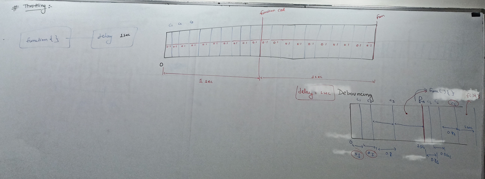

# JavaScript Throttling - Complete Notes

## What is Throttling?

Throttling is a technique in JavaScript used to **limit the rate at which a function can be executed**. It ensures that a function is called at most once within a specified time interval, regardless of how many times the triggering event occurs.

## How Throttling Works

### Core Mechanism
1. **First call executes immediately** - No delay on initial invocation
2. **Subsequent calls are ignored** - Within the specified time interval
3. **Function becomes available again** - After the time interval completes
4. **Uses timestamp comparison** - `Date.now()` to track elapsed time

### Code Implementation Breakdown

```javascript
function mythrottle(cb, d) {
    let prev = 0;  // Stores timestamp of last execution

    let inner = function(...args) {
        let now = Date.now();  // Current timestamp

        // Check if enough time has passed
        if (now - prev < d) {
            return;  // Ignore the call
        }

        prev = now;      // Update last execution time
        cb(...args);     // Execute the callback
    }

    return inner;  // Return the throttled function
}
```

## Key Characteristics

- **Immediate first execution** - No waiting period for the first call
- **Fixed intervals** - Function executes at regular intervals during continuous events
- **Rate limiting** - Controls frequency of function calls
- **Performance optimization** - Prevents excessive function executions

<br><br>

## Common Use Cases

### 1. Scroll Events
```javascript
const handleScroll = mythrottle(() => {
    console.log('Scroll position:', window.scrollY);
}, 100);

window.addEventListener('scroll', handleScroll);
```

### 2. Search Input
```javascript
const handleSearch = mythrottle((query) => {
    // Make API call
    searchAPI(query);
}, 500);
```

### 3. Button Clicks
```javascript
const handleClick = mythrottle(() => {
    // Prevent rapid successive clicks
    submitForm();
}, 1000);
```

### 4. Mouse Movement
```javascript
const handleMouseMove = mythrottle((event) => {
    updateCursorPosition(event.clientX, event.clientY);
}, 50);
```

### 5. Animation Loops
```javascript
const gameLoop = mythrottle(() => {
    updateGameState();
    render();
}, 16); // ~60fps
```

<br><br>
<br><br>


### 6. Social Media Feed Updates
```javascript
const updateFeed = mythrottle(() => {
    fetchLatestPosts();
}, 30000); // Every 30 seconds
```

## Throttling vs Debouncing

| Aspect | Throttling | Debouncing |
|--------|------------|------------|
| **Execution Pattern** | Regular intervals during events | Only after events stop |
| **First Call** | Executes immediately | May delay or execute immediately |
| **Use Case** | Limit frequency during activity | Wait for pause in activity |
| **Example Scenario** | Scroll position tracking | Search suggestions |

### Detailed Comparison

#### Throttling Behavior
```
Events:    |--|--|--|--|--|--|--|--|
Execution: |     ✓     ✓     ✓
Time:      0    1s    2s    3s
```
- Executes every 1 second during continuous events
- Maintains steady execution rate

#### Debouncing Behavior
```
Events:    |--|--|--|--|--|        |--|--|
Execution:                   ✓           ✓
Time:      0  0.1 0.2 0.3 0.4    1.5  1.6 1.7
```
- Executes only after 300ms of silence
- Resets timer on each new event



## When to Use Which?

### Use Throttling When:
- You want **regular updates** during continuous events
- **Performance** is critical (scroll, resize, mouse move)
- You need **consistent execution intervals**
- **Real-time feedback** is important

### Use Debouncing When:
- You want to wait for **user to finish** an action
- **Expensive operations** should only run once
- **Search functionality** with API calls
- **Form validation** after user stops typing

<br><br><br><br><br><br><br><br><br><br><br><br><br><br><br><br>

## Advanced Throttling Concepts

### Leading vs Trailing Edge
- **Leading edge**: Executes immediately on first call (default in our implementation)
- **Trailing edge**: Executes at the end of the time period

### Throttling with Cancel
```javascript
function advancedThrottle(cb, delay) {
    let prev = 0;
    let timeoutId = null;

    function throttled(...args) {
        const now = Date.now();

        if (now - prev >= delay) {
            prev = now;
            cb(...args);
        } else if (!timeoutId) {
            timeoutId = setTimeout(() => {
                prev = Date.now();
                cb(...args);
                timeoutId = null;
            }, delay - (now - prev));
        }
    }
    throttled.cancel = () => {
        clearTimeout(timeoutId);
        timeoutId = null;
    };
    return throttled;
}
```

## Performance Benefits

1. **Reduces CPU usage** - Fewer function executions
2. **Improves user experience** - Smoother interactions
3. **Prevents browser freezing** - Controls heavy operations
4. **Optimizes network requests** - Limits API calls
5. **Better memory management** - Fewer event handler invocations

## Best Practices

1. **Choose appropriate delays**:
   - Scroll events: 10-100ms
   - Search input: 300-500ms
   - Button clicks: 500-1000ms
   - API calls: 1000ms+

2. **Consider user experience**:
   - Too aggressive throttling feels unresponsive
   - Too lenient throttling doesn't solve performance issues

3. **Clean up resources**:
   - Remove event listeners when components unmount
   - Cancel pending throttled calls if needed

4. **Test on different devices**:
   - Mobile devices may need different throttling rates
   - Consider device performance capabilities

## Common Pitfalls

1. **Over-throttling**: Making the interface feel sluggish
2. **Under-throttling**: Not solving the performance problem
3. **Memory leaks**: Not cleaning up event listeners
4. **Context issues**: Losing `this` binding in callbacks
5. **Inconsistent intervals**: Using debouncing when throttling is needed

## Real-World Example Summary

From the provided code:
- **Count**: Updates immediately on every click (no throttling)
- **Request**: Updates at most once per second (throttled)
- **Purpose**: Demonstrates the difference between throttled and non-throttled behavior

This pattern is commonly used in scenarios where you want to show immediate user feedback (count) while limiting expensive operations (request/API calls).


