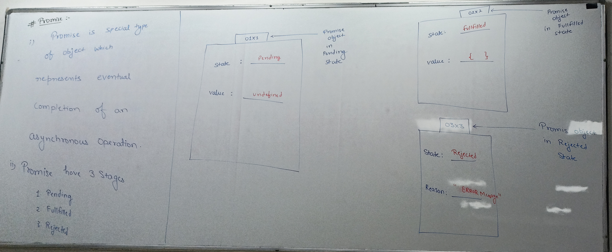
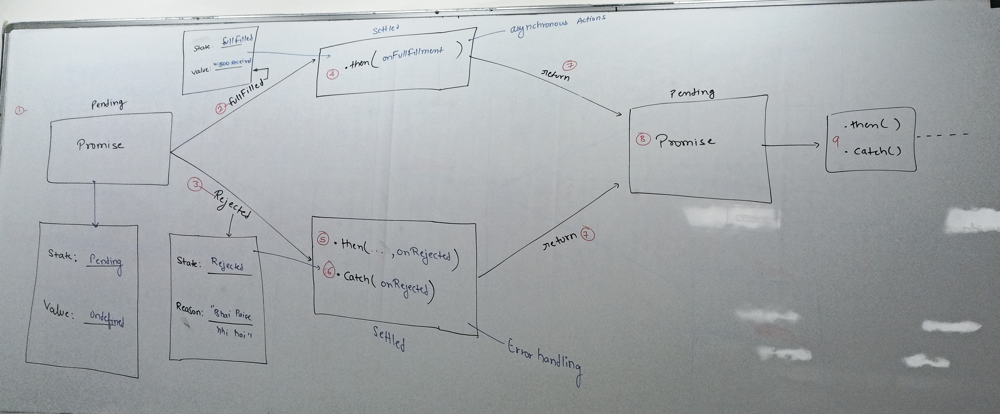
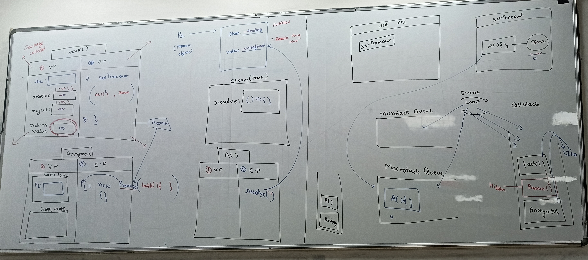
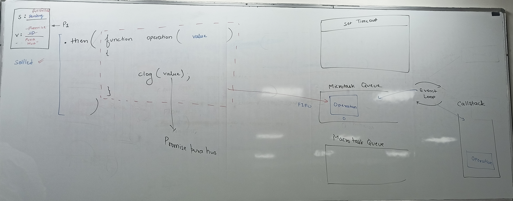
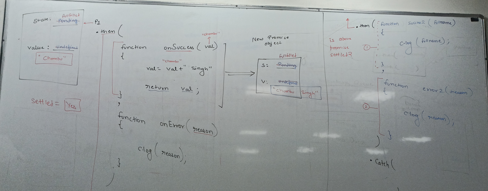

# JavaScript Promise Notes

## What is a Promise?

Promise is a special type of object which represents eventual (at the end) completion of an asynchronous operation (time taking operation).

## Promise States

Promise has 3 stages:

1. **Pending** - Initial state, neither fulfilled nor rejected
2. **Fulfilled** - The operation was completed successfully
3. **Rejected** - The operation is rejected





## Promise Constructor

### Basic Syntax
```javascript
const p1 = new Promise();
```

### How it works:
- `new` keyword loads the Promise() constructor to the p1 variable
- `new` keyword creates an empty object: `{}`
- Empty object reference is saved to the Promise() constructor's `this` keyword

## Promise Example

```javascript
const p1 = new Promise(
    function task(resolve, reject) {
        setTimeout(() => {
            // reject("Yahi dosti yahi payr, bich me aa gai paise ki diwar");
            resolve("Five hundred received");
        }, 3000)
    });

console.log("p1 : ", p1);
```



### Key Points:
- The `task` function is responsible for resolving or rejecting the promise
- Promise will be in **pending state** by default
- Use `resolve()` for successful completion
- Use `reject()` for failure/error cases

## Additional Important Points

### Promise Methods
- **`.then()`** - Handles fulfilled promises
- **`.catch()`** - Handles rejected promises
- **`.finally()`** - Executes regardless of promise outcome

### Promise Chaining
```javascript
promise
  .then(result => { /* handle success */ })
  .catch(error => { /* handle error */ })
  .finally(() => { /* cleanup code */ });
```

### Promise Utilities
- **`Promise.all()`** - Waits for all promises to resolve
- **`Promise.race()`** - Returns first settled promise
- **`Promise.resolve()`** - Creates resolved promise
- **`Promise.reject()`** - Creates rejected promise

<br>

### Common Use Cases
- API calls and HTTP requests
- File operations
- Database operations
- Timer operations (like setTimeout)
- Any asynchronous operation that takes time

### Error Handling
Always handle promise rejections to avoid unhandled promise rejection warnings.


# Promise() Constructor

```javascript
const p1 = new Promise();
```

**Explanation:**

`new` keyword load the Promise() constructor to the p1 variable.

**Note:** new keyword create the empty object, like this: `{}`

empty object reference save ot the promise() constructor `this` keyword.

```javascript
const p1 = new Promise(
    function task(resolve, reject) {
        setTimeout(() => {
            resolve("Five hundred received");
        }, 3000)
    });
```

Here task function responsible for resolve or reject the promise.

Promise will in pending state by-default.

```javascript
console.log("p1 : ", p1);
```




