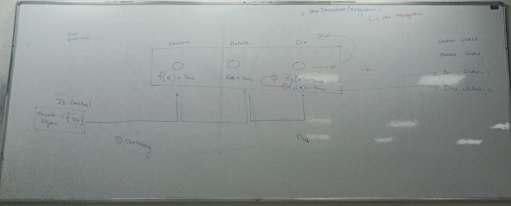
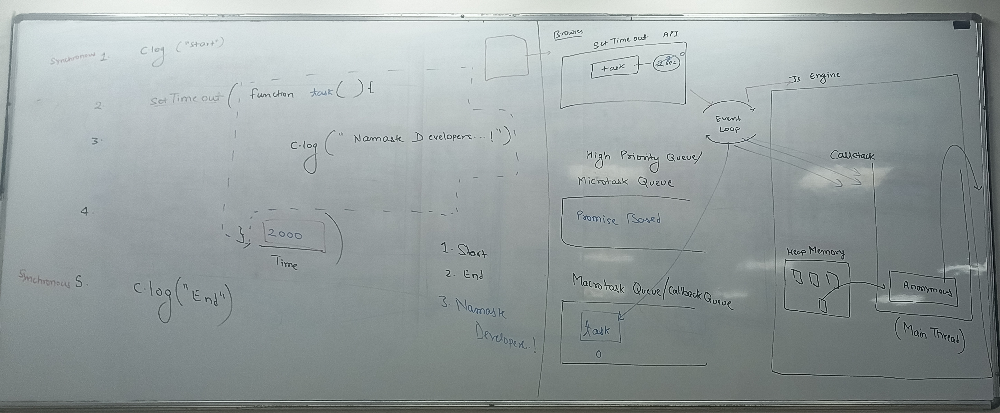
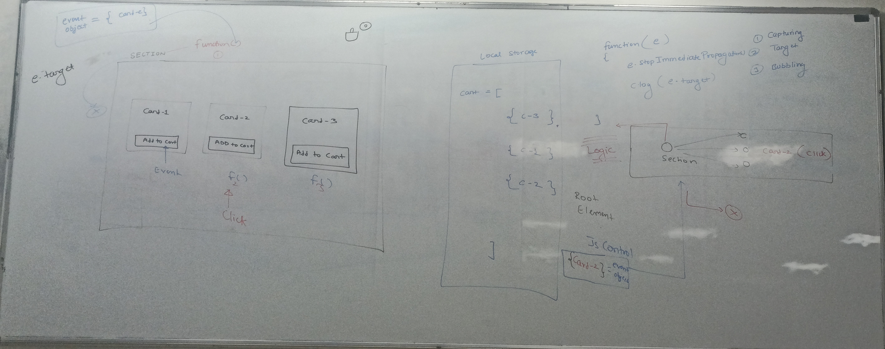

# Event Delegation, Propagation & classList

## 1. Event Delegation

Event delegation is a JavaScript technique where you attach a single event listener to a parent element to handle events for multiple child elements, instead of adding individual listeners to each child.

### How Event Delegation Works

- **Uses Event Bubbling**: Events bubble up from child to parent elements in the DOM tree
- **Target Detection**: The parent listener checks `event.target` to determine which child was actually clicked
- **Dynamic Handling**: Handles events for current children AND future children added dynamically

### Benefits of Event Delegation

1. **Performance**: Fewer event listeners = better memory usage
2. **Dynamic Elements**: Automatically handles newly added elements
3. **Cleaner Code**: One listener instead of many
4. **Event Management**: Easier to add/remove event handling

### Example: Event Delegation

```javascript
// Instead of adding listeners to each button
const container = document.querySelector('.button-container');

container.addEventListener('click', (event) => {
    // Check if clicked element is a button
    if (event.target.matches('button')) {
        console.log(`Button ${event.target.textContent} was clicked`);

        // Handle specific button actions
        const action = event.target.dataset.action;
        switch(action) {
            case 'delete':
                deleteItem(event.target.closest('.item'));
                break;
            case 'edit':
                editItem(event.target.closest('.item'));
                break;
        }
    }
});

// Adding new buttons dynamically - they'll automatically work!
function addNewButton() {
    const newButton = document.createElement('button');
    newButton.textContent = 'New Button';
    newButton.dataset.action = 'delete';
    container.appendChild(newButton);
}
```

---

## 2. Event Propagation

Event propagation describes how events travel through the DOM tree. It has three phases:

### Event Flow Phases

1. **Capturing Phase**: Event travels from root to target element
2. **Target Phase**: Event reaches the target element
3. **Bubbling Phase**: Event travels back up from target to root

### stopPropagation() vs stopImmediatePropagation()

#### `event.stopPropagation()`
- Stops event bubbling to parent/child elements
- Other event listeners on the **same element** still execute
- Less aggressive approach

#### `event.stopImmediatePropagation()`
- Stops event bubbling to parent/child elements
- **Also prevents** any remaining event listeners on the same element from running
- More aggressive - stops everything immediately

<br><br><br><br><br><br><br><br><br><br><br><br><br><br>
<br><br><br><br><br><br><br>

### Event Propagation Examples

```javascript
const section = document.querySelector("section");
const article = document.querySelector("article");
const div = document.querySelector("div");

// Capturing phase listeners (third parameter = true)
section.addEventListener("click", (e) => {
    console.log("Section clicked (capturing)", e.target.tagName);
}, true);

article.addEventListener("click", (e) => {
    console.log("Article clicked (capturing)", e.target.tagName);
}, true);

div.addEventListener("click", (e) => {
    console.log("Div clicked-1 (capturing)", e.target.tagName);
    // e.stopPropagation(); // Would stop here
}, true);

div.addEventListener("click", (e) => {
    console.log("Div clicked-2 (capturing)", e.target.tagName);
}, true);

// Bubbling phase listeners (default: third parameter = false)
div.addEventListener("click", (e) => {
    console.log("Div clicked (bubbling)", e.target.tagName);
});

article.addEventListener("click", (e) => {
    console.log("Article clicked (bubbling)", e.target.tagName);
});

section.addEventListener("click", (e) => {
    console.log("Section clicked (bubbling)", e.target.tagName);
});
```

### Event Listener Options

```javascript
element.addEventListener("click", handler, {
    capture: false,    // Use capturing phase (default: false)
    once: true,        // Execute only once then remove
    passive: true      // Never calls preventDefault()
});
```

---

<br><br><br><br><br><br><br><br>

## 3. classList Methods

The `classList` property provides methods to manipulate CSS classes on elements.

### Basic Methods

```javascript
const element = document.querySelector('.my-element');

// Add classes
element.classList.add('active');
element.classList.add('highlight', 'bold', 'large'); // Multiple classes

// Remove classes
element.classList.remove('inactive');
element.classList.remove('old-class', 'another-class'); // Multiple

// Toggle class (add if not present, remove if present)
element.classList.toggle('visible');

// Check if class exists
if (element.classList.contains('active')) {
    console.log('Element is active');
}

// Replace class
element.classList.replace('old-theme', 'new-theme');
```

### Advanced classList Methods

```javascript
const div = document.querySelector('.container');

// Get all classes as array
const classArray = Array.from(div.classList);
console.log('All classes:', classArray);

// Iterate through classes
div.classList.forEach((className, index) => {
    console.log(`Class ${index}: ${className}`);
});

// Get class by index
console.log('First class:', div.classList.item(0));

// Get class entries (index-value pairs)
const entries = Array.from(div.classList.entries());
console.log('Class entries:', entries); // [[0, 'class1'], [1, 'class2']]

// Get values
const values = Array.from(div.classList.values());
console.log('Class values:', values); // ['class1', 'class2']

// Get keys (indices)
const keys = Array.from(div.classList.keys());
console.log('Class keys:', keys); // [0, 1, 2]

// Check if browser supports a class (CSS feature detection)
console.log('Supports grid:', div.classList.supports('display', 'grid'));
```

---

## 4. Practical Examples

### Theme Switcher (Light/Dark Mode)

```javascript
const themeToggle = document.querySelector('.theme-toggle');
const body = document.body;
const container = document.querySelector('.container');

themeToggle.addEventListener('click', function() {
    const isLight = body.classList.contains('light');

    if (isLight) {
        // Switch to dark mode
        body.classList.replace('light', 'dark');
        container.classList.replace('light', 'dark');
        themeToggle.classList.replace('light', 'dark');
        themeToggle.textContent = 'Switch to Light Mode';
    } else {
        // Switch to light mode
        body.classList.replace('dark', 'light');
        container.classList.replace('dark', 'light');
        themeToggle.classList.replace('dark', 'light');
        themeToggle.textContent = 'Switch to Dark Mode';
    }

    // Save preference
    localStorage.setItem('theme', isLight ? 'dark' : 'light');
});

// Load saved theme on page load
document.addEventListener('DOMContentLoaded', () => {
    const savedTheme = localStorage.getItem('theme') || 'light';
    body.classList.add(savedTheme);
    container.classList.add(savedTheme);
    themeToggle.classList.add(savedTheme);
    themeToggle.textContent = savedTheme === 'light'
        ? 'Switch to Dark Mode'
        : 'Switch to Light Mode';
});
```

<br><br><br><br><br><br><br><br><br><br>
<br><br><br><br>

### Custom Copy Prevention

```javascript
const protectedContent = document.querySelector('.protected-content');

// Prevent copying and show custom message
protectedContent.addEventListener('copy', function(e) {
    e.clipboardData.setData('text/plain', '🚫 Content is protected');
    e.preventDefault();

    // Show notification
    showNotification('Content copying is not allowed!');
});

function showNotification(message) {
    const notification = document.createElement('div');
    notification.className = 'notification';
    notification.textContent = message;
    document.body.appendChild(notification);

    setTimeout(() => {
        notification.remove();
    }, 3000);
}
```

<br><br><br><br><br><br><br><br><br><br><br><br><br><br>
<br><br><br><br><br><br><br><br><br><br><br><br>

### Dynamic List with Event Delegation

```javascript
const todoContainer = document.querySelector('.todo-container');
const addButton = document.querySelector('.add-todo');

// Event delegation for all todo interactions
todoContainer.addEventListener('click', (event) => {
    const target = event.target;
    const todoItem = target.closest('.todo-item');

    if (target.matches('.delete-btn')) {
        deleteTodo(todoItem);
    } else if (target.matches('.complete-btn')) {
        toggleComplete(todoItem);
    } else if (target.matches('.edit-btn')) {
        editTodo(todoItem);
    }
});

function addTodo(text) {
    const todoItem = document.createElement('div');
    todoItem.className = 'todo-item';
    todoItem.innerHTML = `
        <span class="todo-text">${text}</span>
        <button class="complete-btn">✓</button>
        <button class="edit-btn">✎</button>
        <button class="delete-btn">✗</button>
    `;
    todoContainer.appendChild(todoItem);
}

function deleteTodo(todoItem) {
    todoItem.classList.add('fade-out');
    setTimeout(() => todoItem.remove(), 300);
}

function toggleComplete(todoItem) {
    todoItem.classList.toggle('completed');
}
```

---

## 5. Best Practices & Tips

### Event Delegation Best Practices

1. **Use specific selectors**: Check `event.target.matches('.specific-class')`
2. **Handle null cases**: Always check if elements exist
3. **Use closest()**: Find parent elements reliably
4. **Optimize performance**: Use delegation for repeated elements

### classList Best Practices

1. **Batch operations**: Use multiple class names in single calls
2. **Use semantic names**: Classes should describe purpose, not appearance
3. **Check existence**: Use `contains()` before conditional logic
4. **Use toggle wisely**: Great for simple show/hide functionality

### Common Pitfalls to Avoid

1. **Event.target vs Event.currentTarget**:
   - `target` = element that triggered event
   - `currentTarget` = element with the listener

2. **Memory leaks**: Remove event listeners when elements are removed

3. **Passive listeners**: Use for scroll/touch events that don't need preventDefault()

4. **classList browser support**: Modern feature, use polyfills for older browsers

---

## 6. Interview Questions & Answers

**Q: What's the difference between event bubbling and capturing?**
A: Bubbling goes from target to root (bottom-up), capturing goes from root to target (top-down). Bubbling is default behavior.

**Q: When would you use event delegation?**
A: For dynamic content, performance optimization with many similar elements, and cleaner code management.

**Q: What's the difference between stopPropagation() and stopImmediatePropagation()?**
A: stopPropagation() stops bubbling but allows other listeners on same element. stopImmediatePropagation() stops everything immediately.

**Q: How is classList better than className?**
A: classList provides methods for manipulation, prevents overwrites, and handles multiple classes safely.



 
  